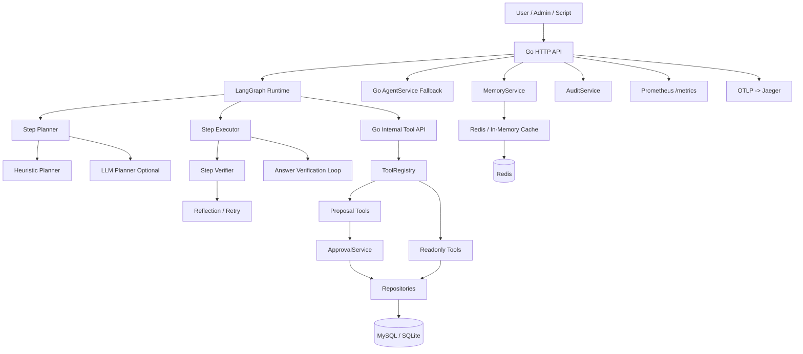
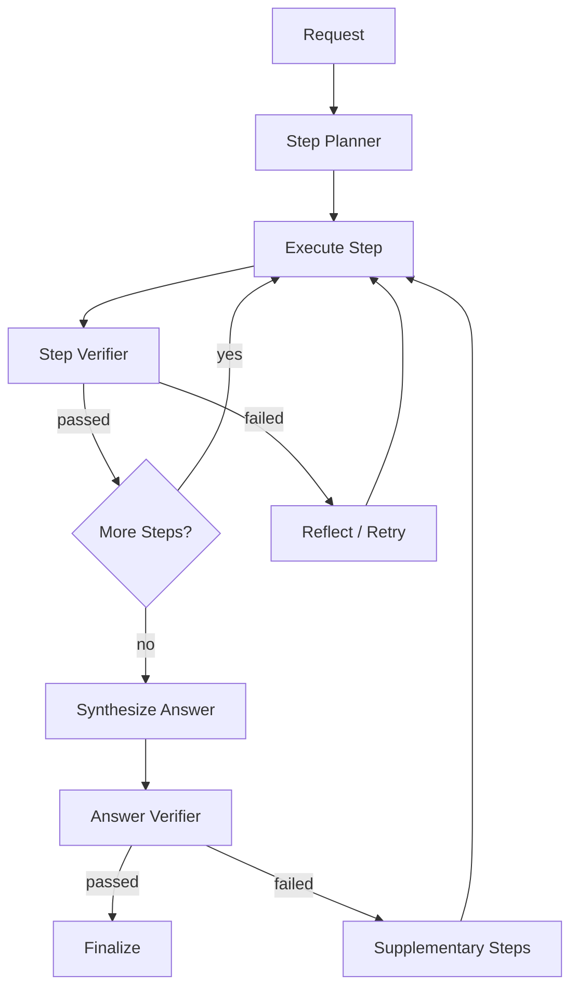

# ops-agent-copilot

面向企业运营场景的 Copilot / Agent 后端。  
项目采用 `LangGraph orchestration + Go deterministic execution` 双层架构，同时保留纯 Go 编排链路作为回退模式。

## 项目定位

- 面向企业运营、客服运营、履约运营等场景的智能体后端
- 聚焦“查询分析 + 异常归因 + 日报生成 + proposal 审批执行”闭环
- 强调治理、安全、审计和可观测，而不是让模型直接改业务库
- 支持 `LangGraph` 多步智能体主链路，也支持纯 Go fallback 链路

## 项目解决的问题

- 运营同学希望通过自然语言直接查询退款率、超 SLA 工单、工单详情和发布记录
- 值班场景需要把“退款异常 + 超 SLA + 最近发布”串起来做归因，而不是只返回单点数据
- 高风险写操作必须经过人工审批，不能让模型直接修改工单系统
- 线上链路需要具备会话记忆、幂等、安全校验、审计追踪和可观测能力

## Agent 能力

项目内置一套面向企业运营场景的多步智能体闭环。

### 1. 任务分解（Planner）

- 基于 LangGraph 显式构建 `step planner`
- 支持把复合请求拆成多步计划，例如把“退款异常 + 超 SLA + 发布记录 + proposal”拆成有序步骤
- 优先走启发式规则规划，复杂请求再进入 LLM planner
- Planner 支持计划缓存，避免相同上下文重复规划
- 规划结果以结构化 step list 落地，而不是只输出一条工具调用

### 2. 多步执行（Executor）

- LangGraph 图按步骤逐步执行工具，维护当前 step index、step results 和 tool call 轨迹
- 支持查询类、分析类、报告类、proposal 类步骤统一编排
- 支持“先看工单详情/操作记录，再生成 proposal”的执行路径
- 支持写请求 `proposal -> approval -> execute` 的多阶段闭环

### 3. 反思与纠错（Reflection / Retry）

- 每个 step 执行后都会做 step-level verification
- 当查询结果为空、过滤条件过严或结果不完整时，会自动放宽条件并重试
- 当前已内置的反思策略包括：
- 退款率查询为空时，自动移除类目/区域限制或放宽时间窗口
- 退款异常查询为空时，自动扩大 `top_k` 或放宽筛选条件
- 超 SLA 查询为空时，自动取消分组或放宽区域限制
- 若最终答案缺少关键证据，还会触发 answer-level reflection，补查缺失步骤

### 4. 工具编排（Tool Orchestration）

- 基于 Go `ToolRegistry` 暴露统一工具面
- LangGraph 通过内部 API 调用 Go 工具，而不是绕过治理层直连数据库
- 只读工具、归因工具、日报工具、proposal 工具走统一编排协议
- 支持显式的多工具顺序编排，而不是把所有复杂逻辑都塞进单个大工具

### 5. 结果闭环（Answer Verification Loop）

- Agent 输出前会做 answer verification，而不是简单拼接工具返回
- 会检查最终回答是否覆盖了用户请求的关键约束，例如：
- 是否回答了“最高类目”这类排序型问题
- 是否覆盖了归因所需的退款、SLA、发布证据
- 写请求是否真正返回了 proposal 和审批信息
- 若答案验证不通过，会补查缺失证据或重新生成答案

### 6. 会话记忆（Memory）

- 保留 session summary、recent turns 和 memory_state
- 自动记住最近工单、区域、类目、日期范围、报告类型
- 支持跟进式问题，例如“这个工单再加个备注”“刚才那个区域继续查”

### 7. 治理与安全（Governance）

- 所有高风险写操作都只会生成 `proposal`
- proposal 强制进入审批流，模型不能直接写业务库
- 审批流包含 `pending -> approved/rejected -> executed/execution_failed`
- 审批与执行链路内建幂等键、乐观锁、审计日志和执行结果持久化

## 业务功能

### 查询与分析

- 自然语言查询退款率指标
- 查询退款率异常类目
- 查询超 SLA 工单，支持按原因、优先级、类目分组
- 查询工单详情
- 查询工单备注和最近操作记录
- 查询最近发布记录
- 联合退款异常、超 SLA 工单和发布记录做归因分析
- 生成运营日报
- 支持受限白名单只读 SQL 查询

### 写操作治理

- 提出工单分派 proposal
- 提出工单备注 proposal
- 提出工单升级 proposal
- 审批通过后执行真实写入
- 可查询审批单列表和审批详情

### 审计与可观测

- 记录 chat_received、proposal_created、approval_approved、write_executed 等审计事件
- 记录 tool call 输入、输出、耗时和成功状态
- 暴露 Prometheus 指标
- 支持 OTLP / Jaeger tracing
- 提供 Admin 页面和 Docs 页面

### 运行与工程能力

- MySQL / SQLite 数据存储
- Redis 缓存和进程内兜底缓存
- Docker Compose 一键启动依赖
- 支持本地 seed、demo、load test 和辅助脚本
- 支持 LangGraph 模式和纯 Go fallback 模式

## 主要工具

- `query_refund_metrics`: 查询退款率指标
- `find_refund_anomalies`: 查询退款率异常类目
- `list_sla_breached_tickets`: 查询超 SLA 工单
- `get_ticket_detail`: 查询工单详情
- `get_ticket_comments`: 查询工单备注和最近操作
- `get_recent_releases`: 查询最近发布记录
- `run_readonly_sql`: 执行受限白名单只读 SQL
- `propose_assign_ticket`: 生成工单分派 proposal
- `propose_add_ticket_comment`: 生成工单备注 proposal
- `propose_escalate_ticket`: 生成工单升级 proposal
- `generate_report`: 生成运营日报

## 系统架构



## Agent 主链路



## 安全控制

### SQL Guard

- 只允许 `SELECT`
- 禁止 `INSERT / UPDATE / DELETE / DROP / ALTER / TRUNCATE`
- 必须带 `LIMIT`
- 只允许访问白名单对象
- 结果规模过大或为空时会被 verifier 拦截或提示补查

### Proposal Verifier

- 校验 ticket 是否存在
- 校验 proposal reason 是否为空
- 校验 assignee / priority / comment_text 是否合法
- 校验当前用户是否具备提交写请求的权限

### Approval 状态机

- `pending -> approved -> executed`
- `pending -> rejected`
- `approved -> execution_failed`

### 并发与一致性

- proposal 使用 `idempotency_key` 抑制重复提交
- 审批更新使用 `version` 做乐观锁控制
- 已执行审批单支持幂等返回持久化结果

## API

### Chat

```http
POST /api/v1/chat
```

请求示例：

```json
{
  "session_id": "demo_metric",
  "user_id": 1,
  "message": "最近7天北京退款率最高的类目是什么？"
}
```

复合归因示例：

```json
{
  "session_id": "demo_anomaly",
  "user_id": 1,
  "message": "北京昨天退款率异常、超SLA工单和最近发布一起做归因分析"
}
```

写请求示例：

```json
{
  "session_id": "demo_write",
  "user_id": 1,
  "message": "先看T202603280012详情和操作记录，再分派给王磊"
}
```

### 审批

```http
GET  /api/v1/approvals
GET  /api/v1/approvals/{approval_no}
POST /api/v1/approvals/{approval_no}/approve
POST /api/v1/approvals/{approval_no}/reject
```

### 审计

```http
GET /api/v1/audit?trace_id=...
```

### 工单详情

```http
GET /api/v1/tickets/{ticket_no}
```

### 系统入口

- Docs: `http://127.0.0.1:18000/docs`
- Admin: `http://127.0.0.1:18000/admin`
- Health: `http://127.0.0.1:18000/healthz`
- Metrics: `http://127.0.0.1:18000/metrics`
- Prometheus: `http://127.0.0.1:19090`
- Grafana: `http://127.0.0.1:13000`
- Jaeger: `http://127.0.0.1:16686`
- Adminer: `http://127.0.0.1:18081`

## 运行模式

- `AGENT_RUNTIME_MODE=langgraph`
  - 默认模式
  - 使用 LangGraph step planner、multi-step executor、reflection 和 answer verification
- `AGENT_RUNTIME_MODE=heuristic`
  - 纯 Go 规则路由模式
  - 适合演示、回退和无 LLM 环境
- `AGENT_RUNTIME_MODE=llm`
  - 使用 Go 侧 LLM planner 的兼容模式

## 快速开始

### 1. 环境要求

- Go `1.25+`
- Python `3.11+`
- Docker Desktop

### 2. 准备环境变量

```powershell
Copy-Item .env.example .env
```

基础配置：

```env
AGENT_RUNTIME_MODE=langgraph
LANGGRAPH_BASE_URL=http://127.0.0.1:8001
OPS_AGENT_BASE_URL=http://127.0.0.1:18000
OTEL_ENABLED=true
OTEL_SERVICE_NAME=ops-agent-copilot
OTEL_EXPORTER_OTLP_ENDPOINT=http://127.0.0.1:4318
```

远程 Kimi 示例：

```env
LLM_PROVIDER=kimi
LLM_BASE_URL=https://api.moonshot.cn/v1
LLM_API_KEY=sk-xxx
LLM_MODEL=kimi-k2-0905-preview
LLM_AUTH_FILE=auth.json
```

本地 Ollama 示例：

```env
LLM_PROVIDER=ollama
LLM_BASE_URL=http://127.0.0.1:11434/v1
LLM_API_KEY=ollama-local
LLM_MODEL=gemma4:e4b
LLM_AUTH_FILE=
```

### 3. 一键启动

```powershell
.\start.ps1 -SkipLLMCheck
```

`start.ps1` 在 `langgraph` 模式下会执行：

1. 检查 `go`
2. 启动 `docker compose`
3. 可选检查 LLM 连通性
4. 安装 Python 依赖
5. 启动 LangGraph runtime
6. 编译 Go 服务
7. 执行 seed
8. 启动 Go API

常用参数：

```powershell
.\start.ps1 -Port 18001
.\start.ps1 -SkipDocker
.\start.ps1 -SkipSeed
.\start.ps1 -SkipLLMCheck
.\start.ps1 -SkipBuild
.\start.ps1 -SkipInstall
```

### 4. 手动启动

```powershell
docker compose up -d
python -m pip install -r requirements.txt
go run ./cmd/seed
python -m uvicorn langgraph_runtime.app:app --host 127.0.0.1 --port 8001
$env:HOST='127.0.0.1'
$env:PORT='18000'
$env:AGENT_RUNTIME_MODE='langgraph'
$env:LANGGRAPH_BASE_URL='http://127.0.0.1:8001'
go run ./cmd/server
```

## 示例脚本

- `scripts/`：启动、演示、压测等辅助脚本
- `scripts/run_load_test.py`

## 目录说明

- `cmd/server`: Go API 入口
- `cmd/seed`: demo 数据初始化
- `internal/app`: Go 业务内核、仓储、审批、安全、审计、工具层
- `langgraph_runtime`: LangGraph step planner、executor、reflection、answer verification
- `ops/`: Prometheus / Grafana 配置
- `scripts/`: demo、压测、辅助脚本
- `docs/`: 设计与运行文档

## 补充说明

- 复杂复合请求支持显式 step planning、多步执行、反思补查和结果闭环
- 高风险写操作仍坚持 proposal + approval，不会绕过治理直接写库
- LangGraph 侧反思策略以规则驱动为主，适合企业运营场景
- 纯 Go fallback 链路可用于回退和兼容运行
