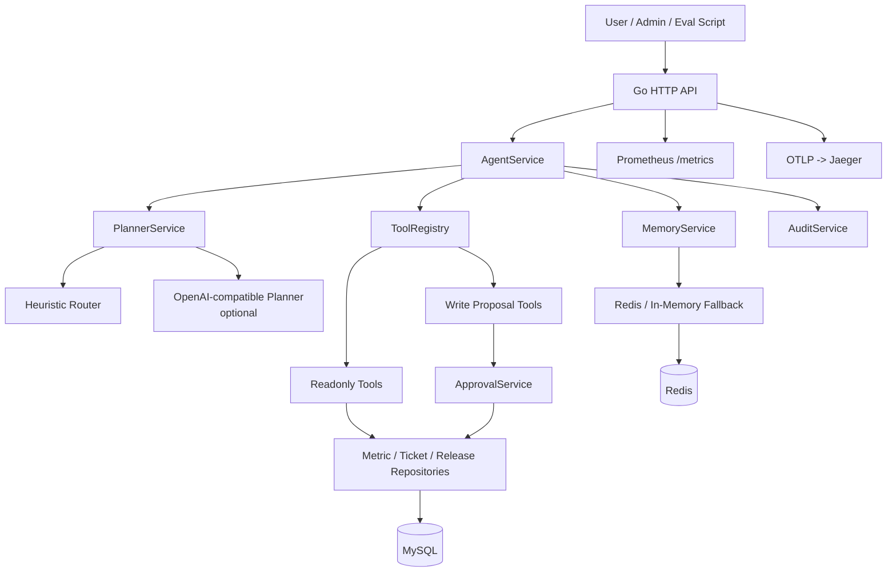

# ops-agent-copilot

面向企业运营场景的治理型 Copilot / Agent 后端。


## 项目定位

- 面向企业运营场景的 Copilot / Agent 后端
- 架构核心是 `LLM planning + deterministic execution`
- 所有高风险写操作统一抽象为 `proposal`
- 写操作必须经过 `approval`，模型不能直接改业务数据
- 默认演示路径为稳定可复现的 Go 在线链路

## 当前已实现能力

查询与分析：

- 自然语言查询退款率指标
- 查询和分组超 SLA 工单
- 查询工单详情、备注和最近操作
- 查询最近发布记录
- 结合退款异常、SLA 工单和发布记录做半自动归因
- 受限白名单只读 SQL 查询
- 生成运营日报

写操作治理：

- 分派工单
- 添加工单备注
- 升级工单优先级
- 所有写操作先生成 proposal，再进入审批流

工程能力：

- 审批状态机
- 幂等与并发控制
- 审计日志与工具调用日志
- Redis + 进程内兜底缓存
- Prometheus 指标
- OTLP / Jaeger tracing
- Admin / Docs 页面

## 系统架构



设计原则：

- LLM 只做规划，不直接写业务库
- 工具执行必须走 Go 的确定性执行层
- 所有高风险写操作统一收敛为 proposal
- proposal 必须进入审批流
- 审批、审计、指标、trace 都内建在主链路

## 快速开始

### 1. 准备环境

- Go `1.25+`
- Docker Desktop
- Python 仅在运行离线评测 / 压测脚本时需要

准备环境文件：

```powershell
Copy-Item .env.example .env
```

推荐至少确认：

```env
AGENT_RUNTIME_MODE=heuristic
OTEL_ENABLED=true
OTEL_SERVICE_NAME=ops-agent-copilot
OTEL_EXPORTER_OTLP_ENDPOINT=http://127.0.0.1:4318
```

### 2. 启动依赖和 Go 服务

最稳妥的本地演示方式：

```powershell
.\start.ps1 -SkipLLMCheck
```

`start.ps1` 当前真实行为：

1. 检查 `go`
2. 启动 `docker compose`
3. 可选做 LLM 连通性检查
4. 编译 Go 服务到 `.tmp/ops-agent-go.exe`
5. 运行 Go seed
6. 前台启动 Go API

常用参数：

```powershell
.\start.ps1 -Port 18001
.\start.ps1 -SkipDocker
.\start.ps1 -SkipSeed
.\start.ps1 -SkipLLMCheck
.\start.ps1 -SkipBuild
```

如果想手动启动：

```powershell
docker compose up -d
go run ./cmd/seed
$env:HOST='127.0.0.1'
$env:PORT='18000'
$env:AGENT_RUNTIME_MODE='heuristic'
$env:OTEL_ENABLED='true'
$env:OTEL_EXPORTER_OTLP_ENDPOINT='http://127.0.0.1:4318'
go run ./cmd/server
```

### 3. 跑一遍闭环 demo

推荐直接运行：

```powershell
.\scripts\interview_demo.ps1
```

这个脚本会依次演示：

1. 只读指标查询
2. 写请求生成 proposal
3. proposal 审批通过并执行
4. 根据 `trace_id` 查询审计日志
5. 查询工单详情确认写入结果

## 访问入口

默认端口 `18000`：

- Docs: `http://127.0.0.1:18000/docs`
- Admin: `http://127.0.0.1:18000/admin`
- Health: `http://127.0.0.1:18000/healthz`
- Metrics: `http://127.0.0.1:18000/metrics`
- Prometheus: `http://127.0.0.1:19090`
- Grafana: `http://127.0.0.1:13000`
- Jaeger: `http://127.0.0.1:16686`
- Adminer: `http://127.0.0.1:18081`

## 示例请求

### 指标查询

```json
POST /api/v1/chat
{
  "session_id": "demo_metric",
  "user_id": 1,
  "message": "最近7天北京区退款率最高的类目是什么？"
}
```

### 异常归因

```json
POST /api/v1/chat
{
  "session_id": "demo_anomaly",
  "user_id": 1,
  "message": "北京区昨天退款率异常和超SLA工单做一下归因分析"
}
```

### 触发写操作 proposal

```json
POST /api/v1/chat
{
  "session_id": "demo_write",
  "user_id": 1,
  "message": "把T202603280012 分派给王磊"
}
```

返回示例：

```json
{
  "trace_id": "8d5478f5aa3931ceea88c204e2e81333",
  "status": "approval_required",
  "approval": {
    "approval_no": "APR20260402054923000000",
    "action_type": "assign_ticket",
    "target_id": "T202603280012"
  }
}
```

### 审批执行

```json
POST /api/v1/approvals/{approval_no}/approve
{
  "approver_user_id": 2
}
```

返回示例：

```json
{
  "status": "executed",
  "execution_result": {
    "success": true,
    "ticket_no": "T202603280012",
    "assignee_name": "王磊"
  }
}
```

### 查看审计

```text
GET /api/v1/audit?trace_id=8d5478f5aa3931ceea88c204e2e81333
```

### 查看工单

```text
GET /api/v1/tickets/T202603280012
```

## 审批与安全控制

### 审批状态机

- `pending -> approved -> executed`
- `pending -> rejected`
- `approved -> execution_failed`

### 一致性与并发控制

- proposal 通过 `idempotency_key` 抑制重复提交
- 审批过程通过 `version` 做乐观锁控制
- 业务写入通过唯一执行约束防止重复执行
- 已执行的 approve 重放会返回同一份持久化结果

### SQL Guard 与 Verifier

- 自由查询只允许白名单只读 SQL
- 只允许 `SELECT`
- 必须限制结果范围
- proposal 执行前会再次校验 ticket、payload、目标用户等信息

## Function Calling 说明

本项目用了 **Function Calling / Tool Calling** 思路。

更准确地说：

- Go 侧定义工具 schema 与工具注册中心
- 可选的 OpenAI-compatible planner 会把工具 schema 发给模型
- 模型只负责输出要调用什么工具
- 真正执行由 Go 的确定性工具层负责
- 所有写操作工具统一落成 proposal，不允许模型直接写业务系统

所以这是 “**LLM 规划 + Go 确定性执行**” 架构。

## 可观测性

当前已经接入并验证：

- Prometheus metrics
- Jaeger tracing
- Admin 审计查询页面

代表性指标：

- `ops_agent_chat_requests_total`
- `ops_agent_chat_latency_ms`
- `ops_agent_tool_calls_total`
- `ops_agent_tool_latency_ms`
- `ops_agent_approval_transitions_total`
- `ops_agent_approval_turnaround_seconds`
- `ops_agent_verifier_rejections_total`
- `ops_agent_planner_requests_total`
- `ops_agent_planner_latency_ms`

代表性 trace spans：

- HTTP 入站 span
- `agent.handle_chat`
- `planner.plan`
- `tool.*`
- `approval.create_proposal`
- `approval.approve`
- `approval.execute_action`

## 代码结构

### Go 在线主链路

- `cmd/server`
- `cmd/seed`
- `internal/app/*`

负责：

- HTTP API
- Planner / Router
- Tool Registry
- Approval / Audit / Cache / Metrics / Trace

### Python 离线工具

- `scripts/run_eval.py`
- `scripts/run_load_test.py`
- `eval/`

