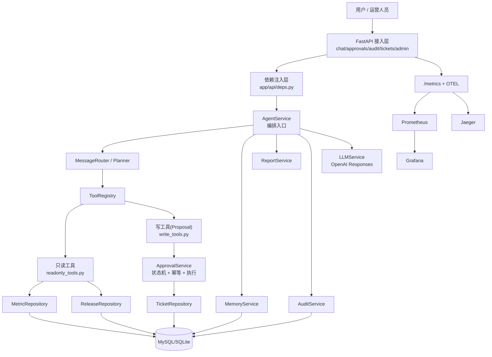

# 系统整体架构图

```mermaid
graph TD
    U["用户 / 运营人员"] --> API["FastAPI 接入层<br/>chat/approvals/audit/tickets/admin"]
    API --> DEP["依赖注入层<br/>app/api/deps.py"]
    DEP --> AG["AgentService<br/>编排入口"]
    AG --> RT["MessageRouter / Planner"]
    RT --> TR["ToolRegistry"]
    TR --> RO["只读工具<br/>readonly_tools.py"]
    TR --> WR["写工具(Proposal)<br/>write_tools.py"]
    WR --> AP["ApprovalService<br/>状态机 + 幂等 + 执行"]
    AP --> TKT["TicketRepository"]
    RO --> MET["MetricRepository"]
    RO --> REL["ReleaseRepository"]
    AG --> MEM["MemoryService"]
    AG --> REP["ReportService"]
    AG --> AUD["AuditService"]
    AG --> LLM["LLMService<br/>OpenAI Responses"]
    AUD --> DB[(MySQL/SQLite)]
    TKT --> DB
    MET --> DB
    REL --> DB
    MEM --> DB
    API --> OBS["/metrics + OTEL"]
    OBS --> PR["Prometheus"]
    OBS --> JG["Jaeger"]
    PR --> GF["Grafana"]
```

