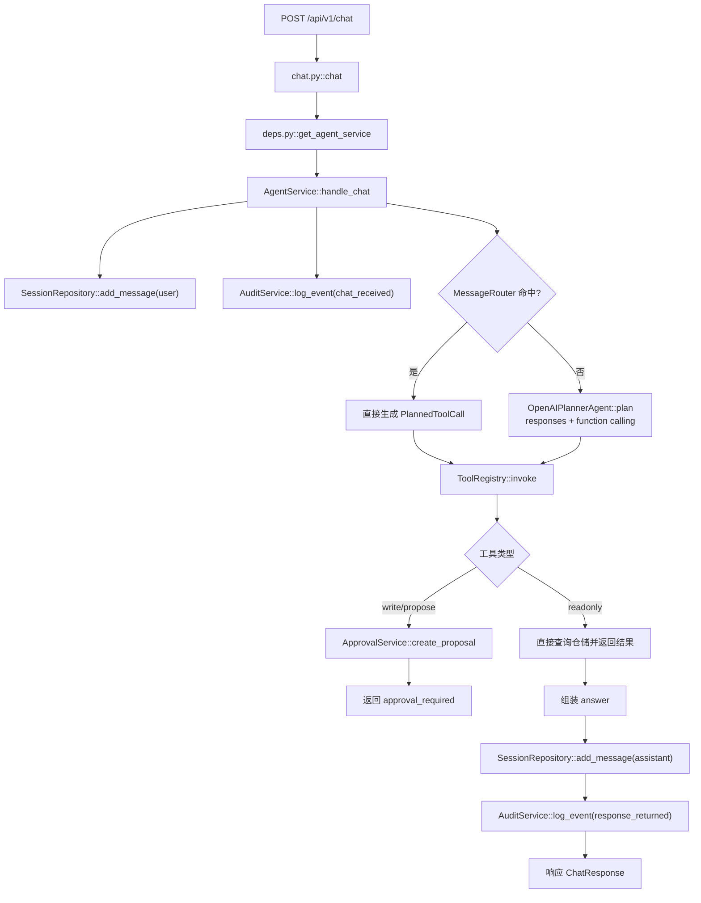
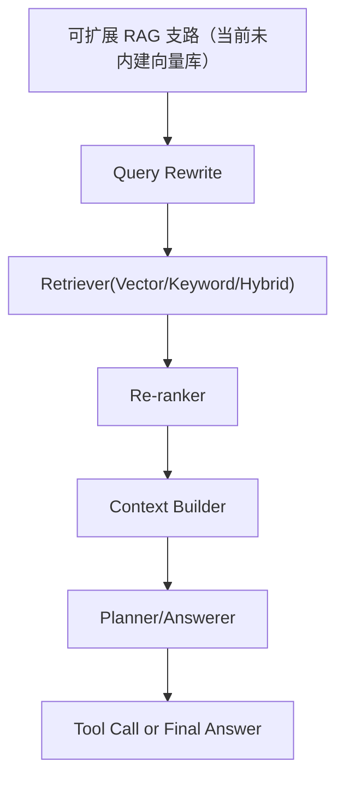

# 请求流程图（当前 API 调用链 + 可扩展 RAG 支路）

```mermaid
flowchart TD
    A["POST /api/v1/chat"] --> B["chat.py::chat"]
    B --> C["deps.py::get_agent_service"]
    C --> D["AgentService::handle_chat"]
    D --> E["SessionRepository::add_message(user)"]
    D --> F["AuditService::log_event(chat_received)"]
    D --> G{"MessageRouter 命中?"}
    G -->|是| H["直接生成 PlannedToolCall"]
    G -->|否| I["OpenAIPlannerAgent::plan<br/>responses + function calling"]
    H --> J["ToolRegistry::invoke"]
    I --> J
    J --> K{"工具类型"}
    K -->|readonly| L["直接查询仓储并返回结果"]
    K -->|write/propose| M["ApprovalService::create_proposal"]
    M --> N["返回 approval_required"]
    L --> O["组装 answer"]
    O --> P["SessionRepository::add_message(assistant)"]
    P --> Q["AuditService::log_event(response_returned)"]
    Q --> R["响应 ChatResponse"]
```

```mermaid
flowchart TD
    S["可扩展 RAG 支路（当前未内建向量库）"] --> T["Query Rewrite"]
    T --> U["Retriever(Vector/Keyword/Hybrid)"]
    U --> V["Re-ranker"]
    V --> W["Context Builder"]
    W --> X["Planner/Answerer"]
    X --> Y["Tool Call or Final Answer"]
```

