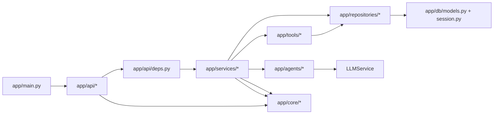

# 核心模块依赖图

```mermaid
graph LR
    MAIN["app/main.py"] --> API["app/api/*"]
    API --> DEPS["app/api/deps.py"]
    DEPS --> SVC["app/services/*"]
    SVC --> REPO["app/repositories/*"]
    SVC --> TOOLS["app/tools/*"]
    SVC --> AGENT["app/agents/*"]
    AGENT --> LLM["LLMService"]
    TOOLS --> REPO
    REPO --> DB["app/db/models.py + session.py"]
    SVC --> CORE["app/core/*"]
    API --> CORE
    SVC --> CORE
```

