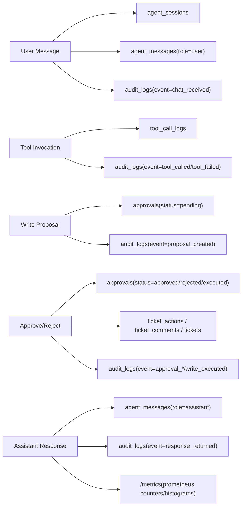

# 数据流图（会话、审批、审计、指标）

```mermaid
flowchart LR
    U["User Message"] --> S1["agent_sessions"]
    U --> S2["agent_messages(role=user)"]
    U --> A1["audit_logs(event=chat_received)"]

    T["Tool Invocation"] --> T1["tool_call_logs"]
    T --> A2["audit_logs(event=tool_called/tool_failed)"]

    W["Write Proposal"] --> P1["approvals(status=pending)"]
    W --> A3["audit_logs(event=proposal_created)"]

    AP["Approve/Reject"] --> P2["approvals(status=approved/rejected/executed)"]
    AP --> TK["ticket_actions / ticket_comments / tickets"]
    AP --> A4["audit_logs(event=approval_*/write_executed)"]

    R["Assistant Response"] --> S3["agent_messages(role=assistant)"]
    R --> A5["audit_logs(event=response_returned)"]
    R --> M["/metrics(prometheus counters/histograms)"]
```

