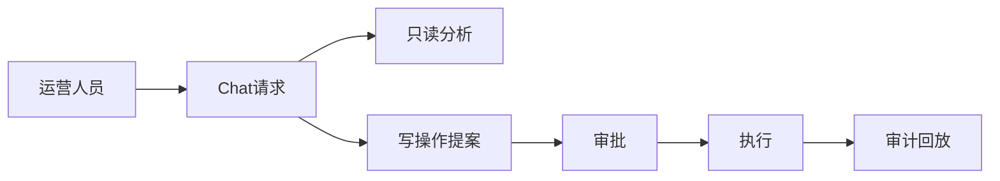

---
title: 项目定位与边界
lesson: 01
series: StudyStepByStep 出版版
audience: 后端工程师（Go面试导向）
recommended_time: 90-120分钟
---

# L01 项目定位与业务边界

## 本课定位
本课帮助你建立“项目全局视角”：系统不是聊天玩具，而是可执行运营系统。

## 图解页

## 核心讲解
- 本项目的核心是“分析 + 执行 + 治理”三位一体。
- 只读能力追求效率，写能力追求安全，审计能力追求可追责。
- 面试时要强调：这是“业务风险控制系统”，不是普通问答机器人。

## 术语表
- **Proposal**：待审批的动作描述，不是已执行动作。
- **Approval**：审批状态实体，承载授权与执行结果。
- **Audit Trail**：可回放的业务证据链。

## 面试问题与标准答案
1. 为什么不能让模型直接写库？  
答案：高风险动作必须可审查、可授权、可追溯，直接写库无法满足治理要求。

2. 这个系统和普通对话系统最大的区别？  
答案：普通对话系统输出文本；本系统输出“可执行动作”，必须有状态机与审计。

3. 核心业务不变量是什么？  
答案：未经审批的高风险写操作不得执行，且执行结果必须可回放。

## 课后任务与参考答案
- 任务1：画出本项目 1 页业务边界图。  
参考：至少包含用户、审批人、后端、数据库、审计查看者五类角色。
- 任务2：写一段 90 秒项目开场白。  
参考：结构为“背景->方案->价值->证据”。

## 关键源码锚点
- [app/main.py](../../app/main.py)
- [app/api/chat.py](../../app/api/chat.py)
- [app/services/agent_service.py](../../app/services/agent_service.py)

## 常见误区
1. 只讲这个功能怎么用，却没有解释为什么这样设计。面试官会继续追问不变量、失败路径和治理边界。
2. 把单机跑通当成生产可用，忽略幂等、并发冲突、审计补偿和可回放。
3. 指标口径与代码实现脱节，只能背结果，不能给出源码证据。

## 实战检查清单
- [ ] 我能用 30 秒说清《项目定位与边界》在整条业务链路中的位置。
- [ ] 我能指出至少 3 个源码锚点，并解释每个锚点的职责边界。
- [ ] 我能说出该课对应的核心不变量和一个失败场景。
- [ ] 我准备了当前方案 tradeoff + 下一步优化的双段式回答。
- [ ] 我可以在白板上画出关键调用链，并标注状态变化。

## 60秒面试口播模板
> 如果面试官问到《项目定位与边界》，我会先给结论：这部分设计的目标不是功能可用，而是在真实生产约束下可治理、可追责、可演进。
> 第二句我会给代码证据：我会从本课的 3 个源码锚点说明职责分层、数据落点和失败处理路径。
> 第三句我会讲工程取舍：当前方案优先保证一致性和可观测性，同时牺牲了部分开发复杂度。
> 最后我会给优化方向：在不破坏不变量的前提下，说明如何做性能优化或分布式扩展。

## 学习导航
- 对应深度章节：[01-基础认知](../01-基础认知/README.md)
- 对应讲师脚本：[L01-项目定位与边界-讲师脚本.md](../讲师版脚本/L01-项目定位与边界-讲师脚本.md)
- 建议串联学习：先回看上一课的输入，再用下一课验证当前设计的边界。

## 延伸阅读与参考文献
1. OpenAPI Specification 3.1
2. RFC 7807: Problem Details for HTTP APIs
3. The Twelve-Factor App
4. FastAPI 官方文档（依赖注入与错误处理）

## 本课小结
- 已完成本课核心概念、代码路径和面试问答训练。
- 建议在24小时内完成一次口述复盘，巩固可表达能力。

> 页脚：StudyStepByStep 出版版 · L01-项目定位与边界 · 最后更新：2026-03-31
