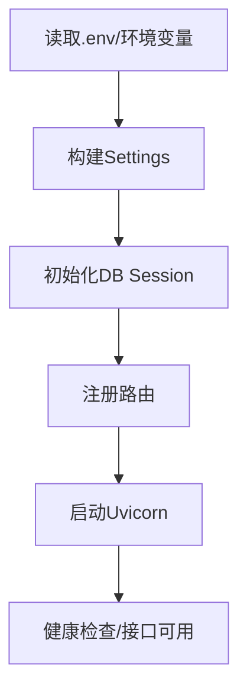

---
title: 启动链路与配置治理
lesson: 02
series: StudyStepByStep 出版版
audience: 后端工程师（Go面试导向）
recommended_time: 90-120分钟
---

# L02 启动链路与配置治理

## 本课定位
学会从配置、依赖、启动、连通性四层排障，避免“启动问题只会重启”。

## 图解页

## 核心讲解
- 配置优先级决定线上可控性：环境变量优先于本地文件。
- `auth.json` 是补充通道，适合本地与中转场景。
- 启动排障要按层进行：配置 -> 依赖 -> 应用，不要直接改业务代码。

## 术语表
- **Fail Fast**：启动阶段尽快暴露不可恢复错误。
- **Config Drift**：配置漂移，环境不一致导致行为不一致。
- **Bootstrap**：应用启动时的初始化过程。

## 面试问题与标准答案
1. 为什么配置优先级很重要？  
答案：它决定线上修复效率和可预期性，优先级混乱会导致“看起来改了配置但不生效”。

2. 为何不只用 `.env`？  
答案：线上部署常依赖环境变量与密钥系统，单一 `.env` 方案缺乏扩展性。

3. 启动报错怎么快速定位？  
答案：先看配置解析结果，再测依赖连通性，最后看应用栈信息。

## 课后任务与参考答案
- 任务1：故意写错 `DATABASE_URL`，给出 8 步排障SOP。  
参考：包含日志位置、配置源、连通测试、修复验证四类动作。
- 任务2：写启动前检查清单。  
参考：DB、Redis、LLM、端口、迁移版本、种子数据六项。

## 关键源码锚点
- [app/core/config.py](../../app/core/config.py)
- [app/main.py](../../app/main.py)
- [app/api/health.py](../../app/api/health.py)

## 常见误区
1. 只讲这个功能怎么用，却没有解释为什么这样设计。面试官会继续追问不变量、失败路径和治理边界。
2. 把单机跑通当成生产可用，忽略幂等、并发冲突、审计补偿和可回放。
3. 指标口径与代码实现脱节，只能背结果，不能给出源码证据。

## 实战检查清单
- [ ] 我能用 30 秒说清《启动链路与配置治理》在整条业务链路中的位置。
- [ ] 我能指出至少 3 个源码锚点，并解释每个锚点的职责边界。
- [ ] 我能说出该课对应的核心不变量和一个失败场景。
- [ ] 我准备了当前方案 tradeoff + 下一步优化的双段式回答。
- [ ] 我可以在白板上画出关键调用链，并标注状态变化。

## 60秒面试口播模板
> 如果面试官问到《启动链路与配置治理》，我会先给结论：这部分设计的目标不是功能可用，而是在真实生产约束下可治理、可追责、可演进。
> 第二句我会给代码证据：我会从本课的 3 个源码锚点说明职责分层、数据落点和失败处理路径。
> 第三句我会讲工程取舍：当前方案优先保证一致性和可观测性，同时牺牲了部分开发复杂度。
> 最后我会给优化方向：在不破坏不变量的前提下，说明如何做性能优化或分布式扩展。

## 学习导航
- 对应深度章节：[01-基础认知](../01-基础认知/README.md)
- 对应讲师脚本：[L02-启动链路与配置治理-讲师脚本.md](../讲师版脚本/L02-启动链路与配置治理-讲师脚本.md)
- 建议串联学习：先回看上一课的输入，再用下一课验证当前设计的边界。

## 延伸阅读与参考文献
1. OpenAPI Specification 3.1
2. RFC 7807: Problem Details for HTTP APIs
3. The Twelve-Factor App
4. FastAPI 官方文档（依赖注入与错误处理）

## 本课小结
- 已完成本课核心概念、代码路径和面试问答训练。
- 建议在24小时内完成一次口述复盘，巩固可表达能力。

> 页脚：StudyStepByStep 出版版 · L02-启动链路与配置治理 · 最后更新：2026-03-31
