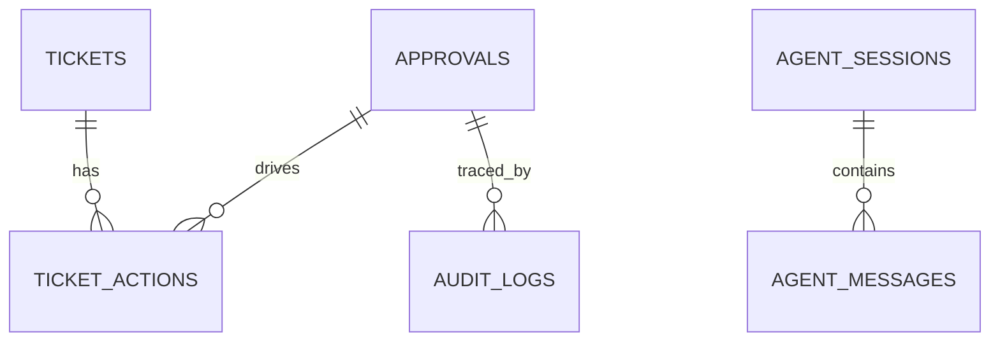

---
title: 数据模型与索引设计
lesson: 03
series: StudyStepByStep 出版版
audience: 后端工程师（Go面试导向）
recommended_time: 90-120分钟
---

# L03 数据模型与索引设计

## 本课定位
让你从“会查表”升级到“会解释表为何这样设计”。

## 图解页

## 核心讲解
- `approvals` 是流程状态主表，不只是记录审批结果。
- `ticket_actions` 保留动作历史，支撑回放和责任追踪。
- 索引设计应围绕查询路径，而非“看到字段就加索引”。

## 术语表
- **Idempotency Key**：业务幂等键。
- **Hot Query**：高频查询路径。
- **Write Amplification**：索引过多导致写开销放大。

## 面试问题与标准答案
1. 为什么要 `idempotency_key`？  
答案：避免重复提案和重复执行，把重试行为收敛为同一业务结果。

2. 为什么动作历史不能只看主表最新状态？  
答案：主表只记录当前态，历史链路丢失后无法审计和复盘。

3. 索引如何评估有效性？  
答案：看执行计划、扫描行数、命中率和写入成本综合收益。

## 课后任务与参考答案
- 任务1：找出审批链路的3条关键查询并说明索引。  
参考：按审批号查详情、按状态查列表、按trace查审计。
- 任务2：写“索引新增评审模板”。  
参考：目标查询、预估收益、回滚方案必须齐全。

## 关键源码锚点
- [app/db/models.py](../../app/db/models.py)
- [app/db/migrations/versions/0001_init.py](../../app/db/migrations/versions/0001_init.py)
- [app/repositories/approval_repo.py](../../app/repositories/approval_repo.py)

## 常见误区
1. 只讲这个功能怎么用，却没有解释为什么这样设计。面试官会继续追问不变量、失败路径和治理边界。
2. 把单机跑通当成生产可用，忽略幂等、并发冲突、审计补偿和可回放。
3. 指标口径与代码实现脱节，只能背结果，不能给出源码证据。

## 实战检查清单
- [ ] 我能用 30 秒说清《数据模型与索引设计》在整条业务链路中的位置。
- [ ] 我能指出至少 3 个源码锚点，并解释每个锚点的职责边界。
- [ ] 我能说出该课对应的核心不变量和一个失败场景。
- [ ] 我准备了当前方案 tradeoff + 下一步优化的双段式回答。
- [ ] 我可以在白板上画出关键调用链，并标注状态变化。

## 60秒面试口播模板
> 如果面试官问到《数据模型与索引设计》，我会先给结论：这部分设计的目标不是功能可用，而是在真实生产约束下可治理、可追责、可演进。
> 第二句我会给代码证据：我会从本课的 3 个源码锚点说明职责分层、数据落点和失败处理路径。
> 第三句我会讲工程取舍：当前方案优先保证一致性和可观测性，同时牺牲了部分开发复杂度。
> 最后我会给优化方向：在不破坏不变量的前提下，说明如何做性能优化或分布式扩展。

## 学习导航
- 对应深度章节：[01-基础认知](../01-基础认知/README.md)
- 对应讲师脚本：[L03-数据模型与索引设计-讲师脚本.md](../讲师版脚本/L03-数据模型与索引设计-讲师脚本.md)
- 建议串联学习：先回看上一课的输入，再用下一课验证当前设计的边界。

## 延伸阅读与参考文献
1. OpenAPI Specification 3.1
2. RFC 7807: Problem Details for HTTP APIs
3. The Twelve-Factor App
4. FastAPI 官方文档（依赖注入与错误处理）

## 本课小结
- 已完成本课核心概念、代码路径和面试问答训练。
- 建议在24小时内完成一次口述复盘，巩固可表达能力。

> 页脚：StudyStepByStep 出版版 · L03-数据模型与索引设计 · 最后更新：2026-03-31
