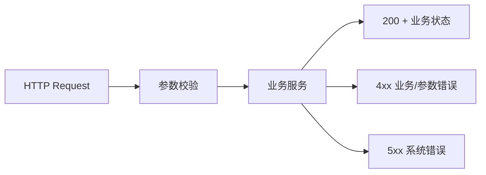

---
title: API契约与错误分层
lesson: 04
series: StudyStepByStep 出版版
audience: 后端工程师（Go面试导向）
recommended_time: 90-120分钟
---

# L04 API契约与错误分层

## 本课定位
掌握“对外契约稳定性”思维，避免只关注内部实现。

## 图解页

## 核心讲解
- API 层职责是协议映射，不是业务编排。
- 错误分层可让前端和调用方稳定处理异常分支。
- 业务状态（completed/approval_required）要与HTTP状态同时设计。

## 术语表
- **Contract Test**：接口契约测试。
- **Backward Compatibility**：向后兼容。
- **Semantic Error Code**：语义化错误码。

## 面试问题与标准答案
1. 为什么要做错误映射？  
答案：把内部异常统一为对外可消费协议，减少客户端分支混乱。

2. 400和409如何区分？  
答案：400是输入不合法，409是资源状态冲突。

3. API怎么做版本兼容？  
答案：新增字段不破坏旧语义，破坏性变更走版本化并配套回归测试。

## 课后任务与参考答案
- 任务1：写10条错误码规范。  
参考：覆盖参数错、冲突、权限、系统错四类。
- 任务2：给chat接口写一条契约测试。  
参考：验证关键字段存在与类型稳定。

## 关键源码锚点
- [app/api/chat.py](../../app/api/chat.py)
- [app/core/exceptions.py](../../app/core/exceptions.py)
- [app/schemas/chat.py](../../app/schemas/chat.py)

## 常见误区
1. 只讲这个功能怎么用，却没有解释为什么这样设计。面试官会继续追问不变量、失败路径和治理边界。
2. 把单机跑通当成生产可用，忽略幂等、并发冲突、审计补偿和可回放。
3. 指标口径与代码实现脱节，只能背结果，不能给出源码证据。

## 实战检查清单
- [ ] 我能用 30 秒说清《API契约与错误分层》在整条业务链路中的位置。
- [ ] 我能指出至少 3 个源码锚点，并解释每个锚点的职责边界。
- [ ] 我能说出该课对应的核心不变量和一个失败场景。
- [ ] 我准备了当前方案 tradeoff + 下一步优化的双段式回答。
- [ ] 我可以在白板上画出关键调用链，并标注状态变化。

## 60秒面试口播模板
> 如果面试官问到《API契约与错误分层》，我会先给结论：这部分设计的目标不是功能可用，而是在真实生产约束下可治理、可追责、可演进。
> 第二句我会给代码证据：我会从本课的 3 个源码锚点说明职责分层、数据落点和失败处理路径。
> 第三句我会讲工程取舍：当前方案优先保证一致性和可观测性，同时牺牲了部分开发复杂度。
> 最后我会给优化方向：在不破坏不变量的前提下，说明如何做性能优化或分布式扩展。

## 学习导航
- 对应深度章节：[01-基础认知](../01-基础认知/README.md)
- 对应讲师脚本：[L04-API契约与错误分层-讲师脚本.md](../讲师版脚本/L04-API契约与错误分层-讲师脚本.md)
- 建议串联学习：先回看上一课的输入，再用下一课验证当前设计的边界。

## 延伸阅读与参考文献
1. OpenAPI Specification 3.1
2. RFC 7807: Problem Details for HTTP APIs
3. The Twelve-Factor App
4. FastAPI 官方文档（依赖注入与错误处理）

## 本课小结
- 已完成本课核心概念、代码路径和面试问答训练。
- 建议在24小时内完成一次口述复盘，巩固可表达能力。

> 页脚：StudyStepByStep 出版版 · L04-API契约与错误分层 · 最后更新：2026-03-31
