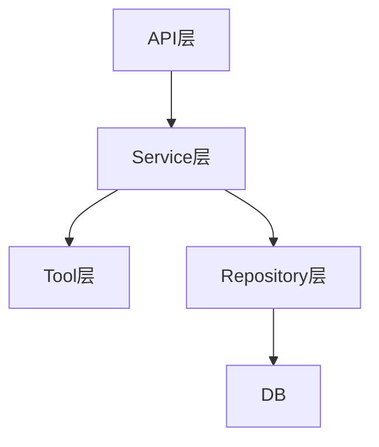

---
title: 分层架构与职责边界
lesson: 05
series: StudyStepByStep 出版版
audience: 后端工程师（Go面试导向）
recommended_time: 90-120分钟
---

# L05 分层架构与职责边界

## 本课定位
建立“边界感”：什么该放 API、Service、Repository、Tool。

## 图解页

## 核心讲解
- 分层不是形式主义，是为了控制复杂度。
- 一段逻辑放错层，短期快，长期维护成本高。
- 面试里要强调“边界清晰比技术栈更重要”。

## 术语表
- **Separation of Concerns**：关注点分离。
- **Layer Leakage**：层职责泄漏。
- **Domain Service**：领域服务。

## 面试问题与标准答案
1. 如何判断逻辑应放哪层？  
答案：看关注点，协议相关放API，流程编排放Service，数据细节放Repo。

2. 分层是否越多越好？  
答案：不是，分层应服务于复杂度降低而非目录美观。

3. 何时需要重构层次？  
答案：当跨层调用混乱、排障成本上升、改动牵一发而动全身时。

## 课后任务与参考答案
- 任务1：找出一段疑似层泄漏代码并重构建议。  
参考：给出迁移前后职责对比图。
- 任务2：画一张本项目分层责任表。  
参考：每层至少写3条“应做/不应做”。

## 关键源码锚点
- [app/api/chat.py](../../app/api/chat.py)
- [app/services/agent_service.py](../../app/services/agent_service.py)
- [app/repositories/session_repo.py](../../app/repositories/session_repo.py)

## 常见误区
1. 只讲这个功能怎么用，却没有解释为什么这样设计。面试官会继续追问不变量、失败路径和治理边界。
2. 把单机跑通当成生产可用，忽略幂等、并发冲突、审计补偿和可回放。
3. 指标口径与代码实现脱节，只能背结果，不能给出源码证据。

## 实战检查清单
- [ ] 我能用 30 秒说清《分层架构与职责边界》在整条业务链路中的位置。
- [ ] 我能指出至少 3 个源码锚点，并解释每个锚点的职责边界。
- [ ] 我能说出该课对应的核心不变量和一个失败场景。
- [ ] 我准备了当前方案 tradeoff + 下一步优化的双段式回答。
- [ ] 我可以在白板上画出关键调用链，并标注状态变化。

## 60秒面试口播模板
> 如果面试官问到《分层架构与职责边界》，我会先给结论：这部分设计的目标不是功能可用，而是在真实生产约束下可治理、可追责、可演进。
> 第二句我会给代码证据：我会从本课的 3 个源码锚点说明职责分层、数据落点和失败处理路径。
> 第三句我会讲工程取舍：当前方案优先保证一致性和可观测性，同时牺牲了部分开发复杂度。
> 最后我会给优化方向：在不破坏不变量的前提下，说明如何做性能优化或分布式扩展。

## 学习导航
- 对应深度章节：[02-核心架构](../02-核心架构/README.md)
- 对应讲师脚本：[L05-分层架构与职责边界-讲师脚本.md](../讲师版脚本/L05-分层架构与职责边界-讲师脚本.md)
- 建议串联学习：先回看上一课的输入，再用下一课验证当前设计的边界。

## 延伸阅读与参考文献
1. Domain-Driven Design (Eric Evans)
2. Clean Architecture (Robert C. Martin)
3. OWASP ASVS / API Security Top 10
4. FastAPI Dependency Injection 文档

## 本课小结
- 已完成本课核心概念、代码路径和面试问答训练。
- 建议在24小时内完成一次口述复盘，巩固可表达能力。

> 页脚：StudyStepByStep 出版版 · L05-分层架构与职责边界 · 最后更新：2026-03-31
