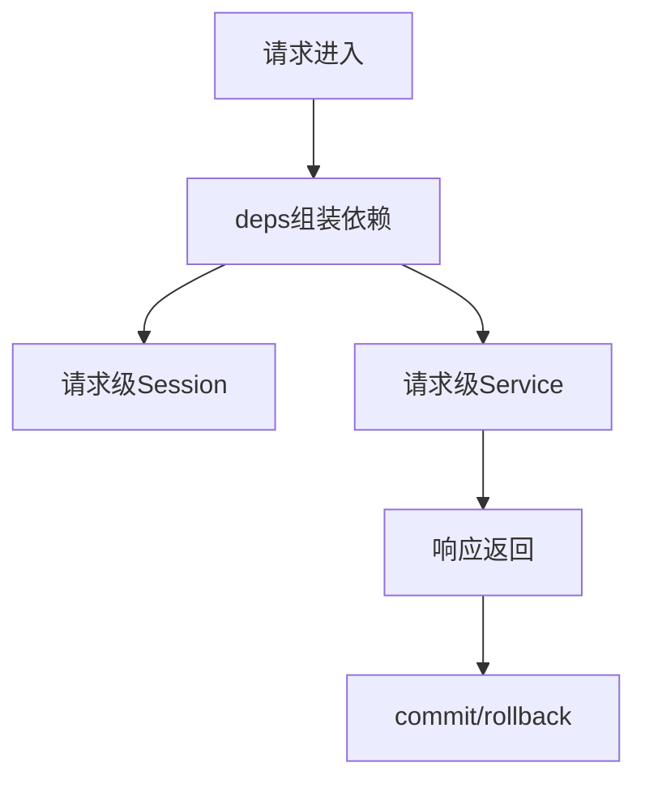

---
title: 依赖注入与生命周期
lesson: 06
series: StudyStepByStep 出版版
audience: 后端工程师（Go面试导向）
recommended_time: 90-120分钟
---

# L06 依赖注入与生命周期

## 本课定位
学会识别请求级对象和全局对象，避免并发污染。

## 图解页

## 核心讲解
- 请求级 session 是事务隔离基础。
- 注入集中在 `deps.py` 可提升一致性和可测试性。
- 上下文对象应透传 trace/user/session，保证审计完整。

## 术语表
- **Request Scope**：请求作用域。
- **Singleton**：单例对象。
- **Context Propagation**：上下文传播。

## 面试问题与标准答案
1. 为什么 `AgentService` 不做全局单例？  
答案：它依赖请求态对象，单例会造成并发状态污染。

2. commit/rollback 为什么在接口层？  
答案：接口层最清楚一次请求是否成功，易于统一事务边界。

3. 注入会不会有性能损耗？  
答案：有但很小，通常远小于IO与外部调用成本。

## 课后任务与参考答案
- 任务1：验证不同请求session对象不同。  
参考：打印对象id并对比。
- 任务2：新增一个依赖并接入get_agent_service。  
参考：确保不破坏现有路由。

## 关键源码锚点
- [app/api/deps.py](../../app/api/deps.py)
- [app/db/session.py](../../app/db/session.py)
- [app/main.py](../../app/main.py)

## 常见误区
1. 只讲这个功能怎么用，却没有解释为什么这样设计。面试官会继续追问不变量、失败路径和治理边界。
2. 把单机跑通当成生产可用，忽略幂等、并发冲突、审计补偿和可回放。
3. 指标口径与代码实现脱节，只能背结果，不能给出源码证据。

## 实战检查清单
- [ ] 我能用 30 秒说清《依赖注入与生命周期》在整条业务链路中的位置。
- [ ] 我能指出至少 3 个源码锚点，并解释每个锚点的职责边界。
- [ ] 我能说出该课对应的核心不变量和一个失败场景。
- [ ] 我准备了当前方案 tradeoff + 下一步优化的双段式回答。
- [ ] 我可以在白板上画出关键调用链，并标注状态变化。

## 60秒面试口播模板
> 如果面试官问到《依赖注入与生命周期》，我会先给结论：这部分设计的目标不是功能可用，而是在真实生产约束下可治理、可追责、可演进。
> 第二句我会给代码证据：我会从本课的 3 个源码锚点说明职责分层、数据落点和失败处理路径。
> 第三句我会讲工程取舍：当前方案优先保证一致性和可观测性，同时牺牲了部分开发复杂度。
> 最后我会给优化方向：在不破坏不变量的前提下，说明如何做性能优化或分布式扩展。

## 学习导航
- 对应深度章节：[02-核心架构](../02-核心架构/README.md)
- 对应讲师脚本：[L06-依赖注入与生命周期-讲师脚本.md](../讲师版脚本/L06-依赖注入与生命周期-讲师脚本.md)
- 建议串联学习：先回看上一课的输入，再用下一课验证当前设计的边界。

## 延伸阅读与参考文献
1. Domain-Driven Design (Eric Evans)
2. Clean Architecture (Robert C. Martin)
3. OWASP ASVS / API Security Top 10
4. FastAPI Dependency Injection 文档

## 本课小结
- 已完成本课核心概念、代码路径和面试问答训练。
- 建议在24小时内完成一次口述复盘，巩固可表达能力。

> 页脚：StudyStepByStep 出版版 · L06-依赖注入与生命周期 · 最后更新：2026-03-31
