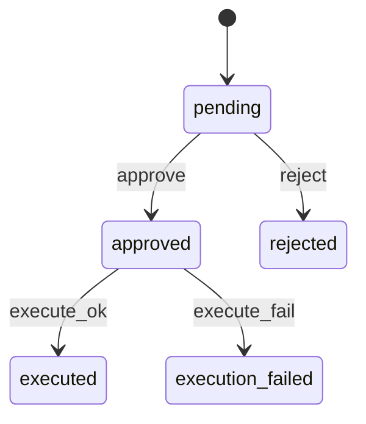

---
title: 写操作安全架构
lesson: 08
series: StudyStepByStep 出版版
audience: 后端工程师（Go面试导向）
recommended_time: 90-120分钟
---

# L08 写操作安全架构（Verifier + 状态机 + 幂等）

## 本课定位
把“安全执行”讲成可验证、可复盘的工程体系。

## 图解页

## 核心讲解
- Verifier 是输入与权限防线。
- 状态机是流程合法性防线。
- 幂等键是重复请求防线。
- 三者共同构成写操作安全闭环。

## 术语表
- **State Machine**：状态机。
- **Optimistic Concurrency**：乐观并发控制。
- **Idempotent Execution**：幂等执行。

## 面试问题与标准答案
1. 为什么状态机要独立模块化？  
答案：集中规则、降低散落if/else导致的非法迁移风险。

2. 重复审批如何处理？  
答案：已执行直接返回结果，冲突状态返回明确错误。

3. 执行失败是否自动重试？  
答案：不盲重试，需先判断失败类型，避免副作用放大。

## 课后任务与参考答案
- 任务1：并发approve同一单据，观察冲突行为。  
参考：记录状态与错误码并解释原因。
- 任务2：人工触发execution_failed并回放审计链。  
参考：核对approval状态与audit事件一致。

## 关键源码锚点
- [app/tools/write_tools.py](../../app/tools/write_tools.py)
- [app/services/approval_service.py](../../app/services/approval_service.py)
- [app/core/security.py](../../app/core/security.py)

## 常见误区
1. 只讲这个功能怎么用，却没有解释为什么这样设计。面试官会继续追问不变量、失败路径和治理边界。
2. 把单机跑通当成生产可用，忽略幂等、并发冲突、审计补偿和可回放。
3. 指标口径与代码实现脱节，只能背结果，不能给出源码证据。

## 实战检查清单
- [ ] 我能用 30 秒说清《写操作安全架构》在整条业务链路中的位置。
- [ ] 我能指出至少 3 个源码锚点，并解释每个锚点的职责边界。
- [ ] 我能说出该课对应的核心不变量和一个失败场景。
- [ ] 我准备了当前方案 tradeoff + 下一步优化的双段式回答。
- [ ] 我可以在白板上画出关键调用链，并标注状态变化。

## 60秒面试口播模板
> 如果面试官问到《写操作安全架构》，我会先给结论：这部分设计的目标不是功能可用，而是在真实生产约束下可治理、可追责、可演进。
> 第二句我会给代码证据：我会从本课的 3 个源码锚点说明职责分层、数据落点和失败处理路径。
> 第三句我会讲工程取舍：当前方案优先保证一致性和可观测性，同时牺牲了部分开发复杂度。
> 最后我会给优化方向：在不破坏不变量的前提下，说明如何做性能优化或分布式扩展。

## 学习导航
- 对应深度章节：[02-核心架构](../02-核心架构/README.md)
- 对应讲师脚本：[L08-写操作安全架构-讲师脚本.md](../讲师版脚本/L08-写操作安全架构-讲师脚本.md)
- 建议串联学习：先回看上一课的输入，再用下一课验证当前设计的边界。

## 延伸阅读与参考文献
1. Domain-Driven Design (Eric Evans)
2. Clean Architecture (Robert C. Martin)
3. OWASP ASVS / API Security Top 10
4. FastAPI Dependency Injection 文档

## 本课小结
- 已完成本课核心概念、代码路径和面试问答训练。
- 建议在24小时内完成一次口述复盘，巩固可表达能力。

> 页脚：StudyStepByStep 出版版 · L08-写操作安全架构 · 最后更新：2026-03-31
