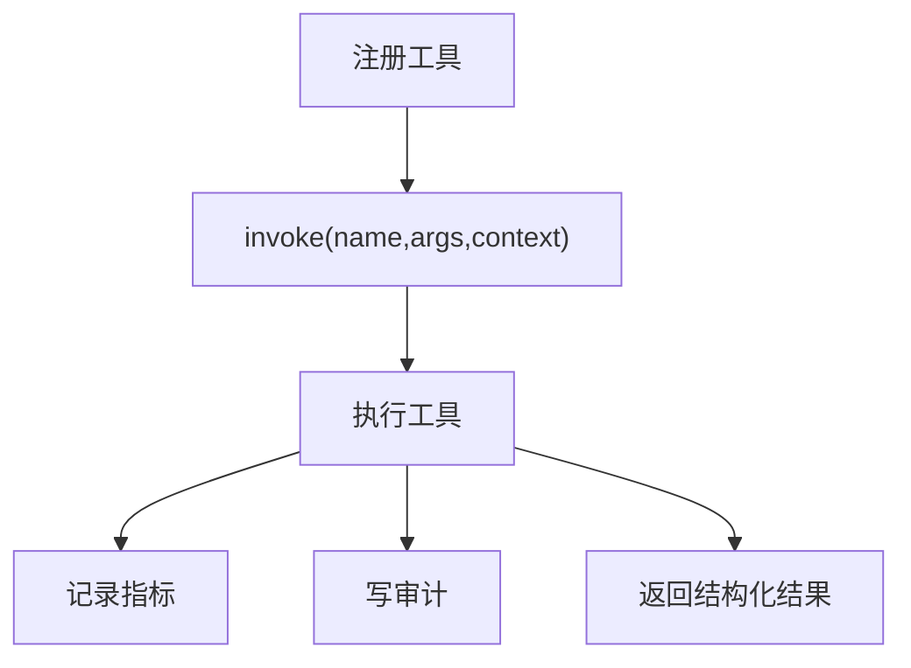

---
title: ToolRegistry治理模式
lesson: 10
series: StudyStepByStep 出版版
audience: 后端工程师（Go面试导向）
recommended_time: 90-120分钟
---

# L10 ToolRegistry 治理模式

## 本课定位
理解“统一执行框架”如何提升可扩展性与治理质量。

## 图解页

## 核心讲解
- registry 让工具执行标准化：输入、输出、异常路径一致。
- 它是工具体系的“控制平面”。
- 工具数量增大时，统一治理收益会迅速放大。

## 术语表
- **Control Plane**：控制平面。
- **Execution Record**：执行记录。
- **Observability Hook**：可观测钩子。

## 面试问题与标准答案
1. 为什么不直接调用工具函数？  
答案：直接调用难以统一埋点、审计和异常治理，扩展性差。

2. registry 会不会成为单点复杂度？  
答案：会，需要按业务域拆分注册与执行策略，保持模块化。

3. 工具失败怎么处理最合理？  
答案：结构化记录失败信息并向上抛出，由编排层决定恢复策略。

## 课后任务与参考答案
- 任务1：新增一个只读工具并完成注册。  
参考：必须补工具schema和审计验证。
- 任务2：为invoke增加超时保护。  
参考：超时也要记录tool_failed事件。

## 关键源码锚点
- [app/services/tool_registry.py](../../app/services/tool_registry.py)
- [app/schemas/tool.py](../../app/schemas/tool.py)
- [app/tools/base.py](../../app/tools/base.py)

## 常见误区
1. 只讲这个功能怎么用，却没有解释为什么这样设计。面试官会继续追问不变量、失败路径和治理边界。
2. 把单机跑通当成生产可用，忽略幂等、并发冲突、审计补偿和可回放。
3. 指标口径与代码实现脱节，只能背结果，不能给出源码证据。

## 实战检查清单
- [ ] 我能用 30 秒说清《ToolRegistry治理模式》在整条业务链路中的位置。
- [ ] 我能指出至少 3 个源码锚点，并解释每个锚点的职责边界。
- [ ] 我能说出该课对应的核心不变量和一个失败场景。
- [ ] 我准备了当前方案 tradeoff + 下一步优化的双段式回答。
- [ ] 我可以在白板上画出关键调用链，并标注状态变化。

## 60秒面试口播模板
> 如果面试官问到《ToolRegistry治理模式》，我会先给结论：这部分设计的目标不是功能可用，而是在真实生产约束下可治理、可追责、可演进。
> 第二句我会给代码证据：我会从本课的 3 个源码锚点说明职责分层、数据落点和失败处理路径。
> 第三句我会讲工程取舍：当前方案优先保证一致性和可观测性，同时牺牲了部分开发复杂度。
> 最后我会给优化方向：在不破坏不变量的前提下，说明如何做性能优化或分布式扩展。

## 学习导航
- 对应深度章节：[03-核心模块拆解](../03-核心模块拆解/README.md)
- 对应讲师脚本：[L10-ToolRegistry治理模式-讲师脚本.md](../讲师版脚本/L10-ToolRegistry治理模式-讲师脚本.md)
- 建议串联学习：先回看上一课的输入，再用下一课验证当前设计的边界。

## 延伸阅读与参考文献
1. SQLAlchemy 2.0 官方文档
2. Alembic 官方文档（迁移与版本管理）
3. Idempotency-Key 设计实践（Stripe Engineering）
4. Outbox Pattern / Transactional Messaging 实践

## 本课小结
- 已完成本课核心概念、代码路径和面试问答训练。
- 建议在24小时内完成一次口述复盘，巩固可表达能力。

> 页脚：StudyStepByStep 出版版 · L10-ToolRegistry治理模式 · 最后更新：2026-03-31
