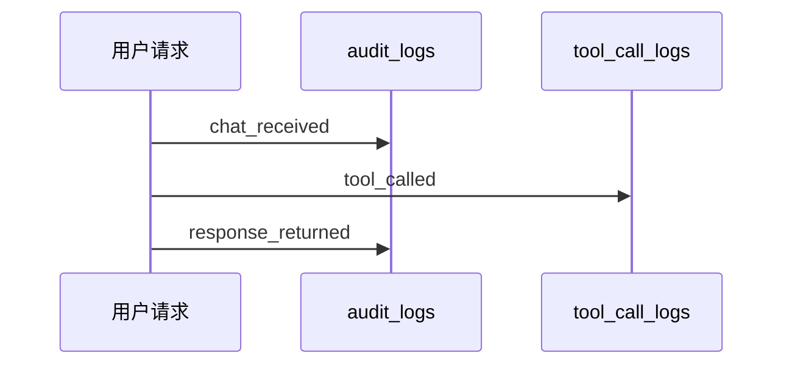

---
title: 审计系统与可回放
lesson: 14
series: StudyStepByStep 出版版
audience: 后端工程师（Go面试导向）
recommended_time: 90-120分钟
---

# L14 审计系统与可回放

## 本课定位
把“记录日志”升级为“还原事实链”。

## 图解页

## 术语表
- Audit Event：审计事件
- Trace Replay：链路回放
- Event Taxonomy：事件分类体系

## 面试问题与标准答案
1. 审计为什么不能等同应用日志？  
答案：应用日志偏技术细节，审计日志偏业务事实与合规证据。
2. trace_id价值？  
答案：跨模块关联键，支持一次请求全链路回放。
3. 审计数据大了怎么办？  
答案：冷热分层、索引优化、归档策略、保留周期治理。

## 课后任务与参考答案
- 任务：按trace_id回放一次写操作全链路。  
参考：列出时间线和关键状态变化。

## 关键源码锚点
- [app/services/audit_service.py](../../app/services/audit_service.py)
- [app/repositories/audit_repo.py](../../app/repositories/audit_repo.py)
- [app/api/audit.py](../../app/api/audit.py)

## 常见误区
1. 只讲这个功能怎么用，却没有解释为什么这样设计。面试官会继续追问不变量、失败路径和治理边界。
2. 把单机跑通当成生产可用，忽略幂等、并发冲突、审计补偿和可回放。
3. 指标口径与代码实现脱节，只能背结果，不能给出源码证据。

## 实战检查清单
- [ ] 我能用 30 秒说清《审计系统与可回放》在整条业务链路中的位置。
- [ ] 我能指出至少 3 个源码锚点，并解释每个锚点的职责边界。
- [ ] 我能说出该课对应的核心不变量和一个失败场景。
- [ ] 我准备了当前方案 tradeoff + 下一步优化的双段式回答。
- [ ] 我可以在白板上画出关键调用链，并标注状态变化。

## 60秒面试口播模板
> 如果面试官问到《审计系统与可回放》，我会先给结论：这部分设计的目标不是功能可用，而是在真实生产约束下可治理、可追责、可演进。
> 第二句我会给代码证据：我会从本课的 3 个源码锚点说明职责分层、数据落点和失败处理路径。
> 第三句我会讲工程取舍：当前方案优先保证一致性和可观测性，同时牺牲了部分开发复杂度。
> 最后我会给优化方向：在不破坏不变量的前提下，说明如何做性能优化或分布式扩展。

## 学习导航
- 对应深度章节：[03-核心模块拆解](../03-核心模块拆解/README.md)
- 对应讲师脚本：[L14-审计系统与可回放-讲师脚本.md](../讲师版脚本/L14-审计系统与可回放-讲师脚本.md)
- 建议串联学习：先回看上一课的输入，再用下一课验证当前设计的边界。

## 延伸阅读与参考文献
1. SQLAlchemy 2.0 官方文档
2. Alembic 官方文档（迁移与版本管理）
3. Idempotency-Key 设计实践（Stripe Engineering）
4. Outbox Pattern / Transactional Messaging 实践

## 本课小结
- 已完成本课核心概念、代码路径和面试问答训练。
- 建议在24小时内完成一次口述复盘，巩固可表达能力。

> 页脚：StudyStepByStep 出版版 · L14-审计系统与可回放 · 最后更新：2026-03-31
