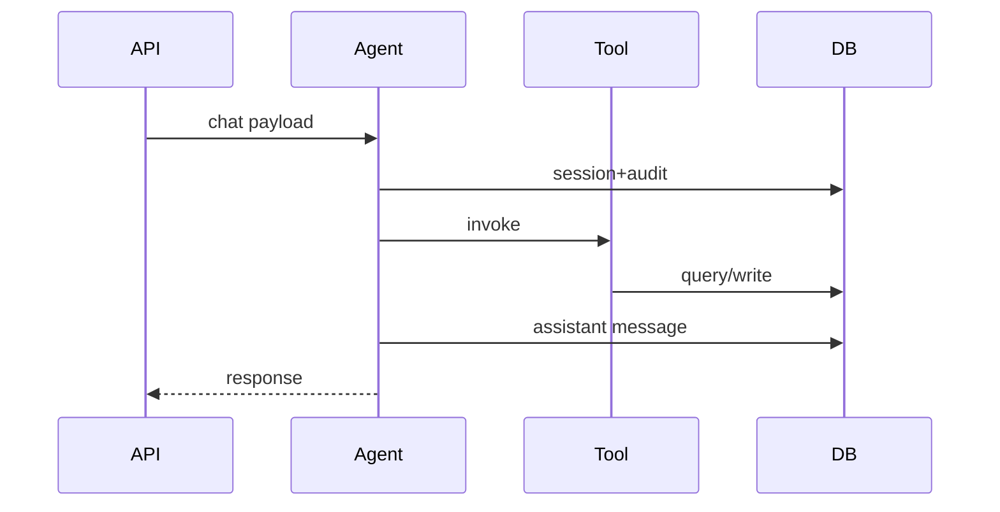

---
title: Chat端到端时序
lesson: 19
series: StudyStepByStep 出版版
audience: 后端工程师（Go面试导向）
recommended_time: 90-120分钟
---

# L19 Chat 端到端时序

## 本课定位
把一次请求拆成可测量、可定位、可优化的时序阶段。

## 图解页

## 术语表
- End-to-end Latency：端到端延迟
- Stage Timing：分段耗时
- Critical Path：关键路径

## 面试问题与标准答案
1. 关键耗时在哪里？  
答案：路由决策、工具执行、数据库提交通常是三大耗时点。
2. 如何定位长尾请求？  
答案：按trace_id看阶段耗时并关联工具/SQL日志。
3. 为什么业务状态也要统计？  
答案：HTTP成功不代表业务完成，状态分布更反映真实质量。

## 课后任务与参考答案
- 任务：输出一次请求的阶段耗时报告。  
参考：至少包含6个阶段并给优化建议。

## 关键源码锚点
- [app/api/chat.py](../../app/api/chat.py)
- [app/services/agent_service.py](../../app/services/agent_service.py)
- [app/services/tool_registry.py](../../app/services/tool_registry.py)

## 常见误区
1. 只讲这个功能怎么用，却没有解释为什么这样设计。面试官会继续追问不变量、失败路径和治理边界。
2. 把单机跑通当成生产可用，忽略幂等、并发冲突、审计补偿和可回放。
3. 指标口径与代码实现脱节，只能背结果，不能给出源码证据。

## 实战检查清单
- [ ] 我能用 30 秒说清《Chat端到端时序》在整条业务链路中的位置。
- [ ] 我能指出至少 3 个源码锚点，并解释每个锚点的职责边界。
- [ ] 我能说出该课对应的核心不变量和一个失败场景。
- [ ] 我准备了当前方案 tradeoff + 下一步优化的双段式回答。
- [ ] 我可以在白板上画出关键调用链，并标注状态变化。

## 60秒面试口播模板
> 如果面试官问到《Chat端到端时序》，我会先给结论：这部分设计的目标不是功能可用，而是在真实生产约束下可治理、可追责、可演进。
> 第二句我会给代码证据：我会从本课的 3 个源码锚点说明职责分层、数据落点和失败处理路径。
> 第三句我会讲工程取舍：当前方案优先保证一致性和可观测性，同时牺牲了部分开发复杂度。
> 最后我会给优化方向：在不破坏不变量的前提下，说明如何做性能优化或分布式扩展。

## 学习导航
- 对应深度章节：[04-数据流与调用链](../04-数据流与调用链/README.md)
- 对应讲师脚本：[L19-Chat端到端时序-讲师脚本.md](../讲师版脚本/L19-Chat端到端时序-讲师脚本.md)
- 建议串联学习：先回看上一课的输入，再用下一课验证当前设计的边界。

## 延伸阅读与参考文献
1. W3C Trace Context
2. Saga Pattern（分布式事务补偿）
3. Martin Fowler: Event Sourcing / Audit Log
4. OpenTelemetry Trace 设计指南

## 本课小结
- 已完成本课核心概念、代码路径和面试问答训练。
- 建议在24小时内完成一次口述复盘，巩固可表达能力。

> 页脚：StudyStepByStep 出版版 · L19-Chat端到端时序 · 最后更新：2026-03-31
