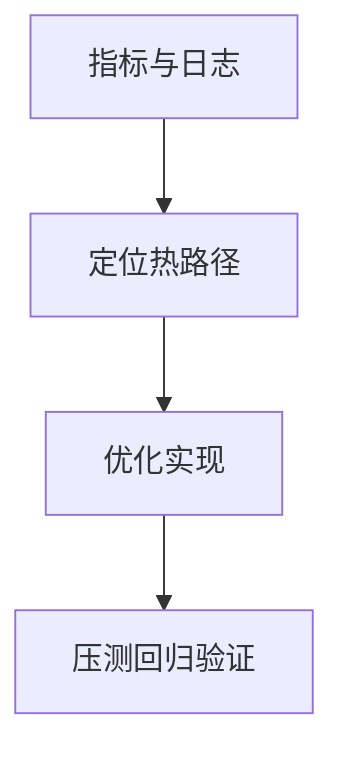

---
title: 热路径优化策略
lesson: 24
series: StudyStepByStep 出版版
audience: 后端工程师（Go面试导向）
recommended_time: 90-120分钟
---

# L24 热路径优化策略

## 本课定位
掌握“先找热点再优化”的方法论，避免低收益优化。

## 图解页

## 术语表
- Hot Path：热路径
- Bottleneck：瓶颈
- Regression：回归

## 面试问题与标准答案
1. 优化优先级如何排？  
答案：高频且高耗时优先，其次高风险路径。
2. 规则路由增多会怎样？  
答案：命中提升但维护成本上升，需规则治理。
3. DB优化常见误区？  
答案：只加索引不看执行计划和写放大。

## 课后任务与参考答案
- 任务：优化1条慢查询并给前后对比。  
参考：说明收益、成本、风险。

## 关键源码锚点
- [app/services/agent_service.py](../../app/services/agent_service.py)
- [app/services/tool_registry.py](../../app/services/tool_registry.py)
- [app/tools/readonly_tools.py](../../app/tools/readonly_tools.py)

## 常见误区
1. 只讲这个功能怎么用，却没有解释为什么这样设计。面试官会继续追问不变量、失败路径和治理边界。
2. 把单机跑通当成生产可用，忽略幂等、并发冲突、审计补偿和可回放。
3. 指标口径与代码实现脱节，只能背结果，不能给出源码证据。

## 实战检查清单
- [ ] 我能用 30 秒说清《热路径优化策略》在整条业务链路中的位置。
- [ ] 我能指出至少 3 个源码锚点，并解释每个锚点的职责边界。
- [ ] 我能说出该课对应的核心不变量和一个失败场景。
- [ ] 我准备了当前方案 tradeoff + 下一步优化的双段式回答。
- [ ] 我可以在白板上画出关键调用链，并标注状态变化。

## 60秒面试口播模板
> 如果面试官问到《热路径优化策略》，我会先给结论：这部分设计的目标不是功能可用，而是在真实生产约束下可治理、可追责、可演进。
> 第二句我会给代码证据：我会从本课的 3 个源码锚点说明职责分层、数据落点和失败处理路径。
> 第三句我会讲工程取舍：当前方案优先保证一致性和可观测性，同时牺牲了部分开发复杂度。
> 最后我会给优化方向：在不破坏不变量的前提下，说明如何做性能优化或分布式扩展。

## 学习导航
- 对应深度章节：[05-性能与优化](../05-性能与优化/README.md)
- 对应讲师脚本：[L24-热路径优化策略-讲师脚本.md](../讲师版脚本/L24-热路径优化策略-讲师脚本.md)
- 建议串联学习：先回看上一课的输入，再用下一课验证当前设计的边界。

## 延伸阅读与参考文献
1. Google SRE Book（容量与性能治理）
2. RED / USE 指标体系
3. k6 官方文档（压测建模）
4. Circuit Breaker Pattern（稳定性保护）

## 本课小结
- 已完成本课核心概念、代码路径和面试问答训练。
- 建议在24小时内完成一次口述复盘，巩固可表达能力。

> 页脚：StudyStepByStep 出版版 · L24-热路径优化策略 · 最后更新：2026-03-31
