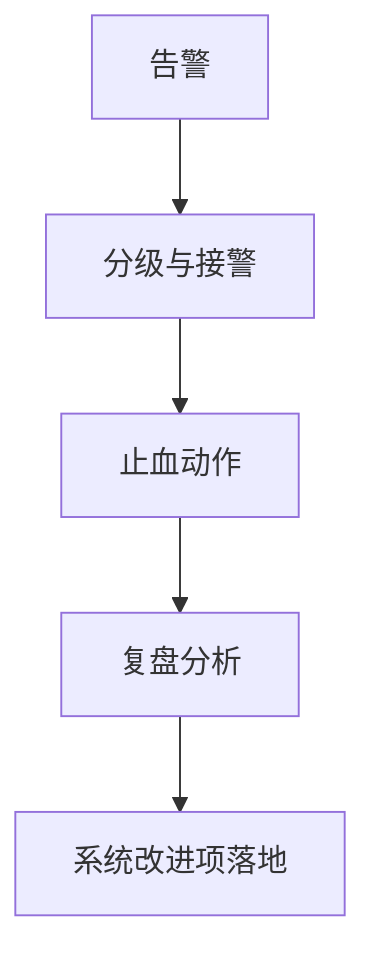

---
title: SRE化运营与Runbook
lesson: 29
series: StudyStepByStep 出版版
audience: 后端工程师（Go面试导向）
recommended_time: 90-120分钟
---

# L29 SRE化运营与Runbook

## 本课定位
从“开发完成”走到“线上长期稳定运行”。

## 图解页

## 术语表
- Incident Triage：故障分级
- Runbook：处置手册
- RCA：根因分析

## 面试问题与标准答案
1. 如何避免告警疲劳？  
答案：降噪、分级、聚合，并确保告警可行动。
2. runbook最关键内容？  
答案：定位路径、止血动作、升级规则、责任人。
3. 复盘应输出什么？  
答案：系统改进项与闭环时间表，不止时间线。

## 课后任务与参考答案
- 任务：写“审批失败率激增”runbook。  
参考：包含5分钟止血方案和24小时复盘计划。

## 关键源码锚点
- [app/jobs/daily_report_job.py](../../app/jobs/daily_report_job.py)
- [docs/RUN_DEBUG_VISUALIZE.md](../../docs/RUN_DEBUG_VISUALIZE.md)
- [docs/STATE_MACHINE_OBSERVABILITY.md](../../docs/STATE_MACHINE_OBSERVABILITY.md)

## 常见误区
1. 只讲这个功能怎么用，却没有解释为什么这样设计。面试官会继续追问不变量、失败路径和治理边界。
2. 把单机跑通当成生产可用，忽略幂等、并发冲突、审计补偿和可回放。
3. 指标口径与代码实现脱节，只能背结果，不能给出源码证据。

## 实战检查清单
- [ ] 我能用 30 秒说清《SRE化运营与Runbook》在整条业务链路中的位置。
- [ ] 我能指出至少 3 个源码锚点，并解释每个锚点的职责边界。
- [ ] 我能说出该课对应的核心不变量和一个失败场景。
- [ ] 我准备了当前方案 tradeoff + 下一步优化的双段式回答。
- [ ] 我可以在白板上画出关键调用链，并标注状态变化。

## 60秒面试口播模板
> 如果面试官问到《SRE化运营与Runbook》，我会先给结论：这部分设计的目标不是功能可用，而是在真实生产约束下可治理、可追责、可演进。
> 第二句我会给代码证据：我会从本课的 3 个源码锚点说明职责分层、数据落点和失败处理路径。
> 第三句我会讲工程取舍：当前方案优先保证一致性和可观测性，同时牺牲了部分开发复杂度。
> 最后我会给优化方向：在不破坏不变量的前提下，说明如何做性能优化或分布式扩展。

## 学习导航
- 对应深度章节：[06-工程化能力](../06-工程化能力/README.md)
- 对应讲师脚本：[L29-SRE化运营与Runbook-讲师脚本.md](../讲师版脚本/L29-SRE化运营与Runbook-讲师脚本.md)
- 建议串联学习：先回看上一课的输入，再用下一课验证当前设计的边界。

## 延伸阅读与参考文献
1. pytest 官方文档（测试分层）
2. Trunk-Based Development
3. Blue-Green / Canary 发布实践
4. SRE Workbook（Runbook 与故障演练）

## 本课小结
- 已完成本课核心概念、代码路径和面试问答训练。
- 建议在24小时内完成一次口述复盘，巩固可表达能力。

> 页脚：StudyStepByStep 出版版 · L29-SRE化运营与Runbook · 最后更新：2026-03-31
