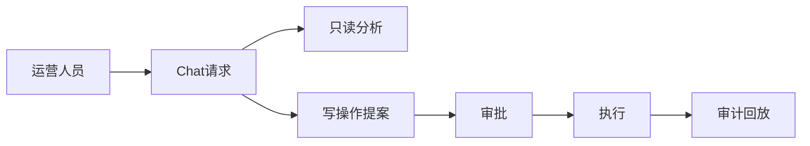

# L01 项目定位与业务边界

## 本课定位
本课帮助你建立“项目全局视角”：系统不是聊天玩具，而是可执行运营系统。

## 图解页

## 核心讲解
- 本项目的核心是“分析 + 执行 + 治理”三位一体。
- 只读能力追求效率，写能力追求安全，审计能力追求可追责。
- 面试时要强调：这是“业务风险控制系统”，不是普通问答机器人。

## 术语表
- **Proposal**：待审批的动作描述，不是已执行动作。
- **Approval**：审批状态实体，承载授权与执行结果。
- **Audit Trail**：可回放的业务证据链。

## 面试问题与标准答案
1. 为什么不能让模型直接写库？  
答案：高风险动作必须可审查、可授权、可追溯，直接写库无法满足治理要求。

2. 这个系统和普通对话系统最大的区别？  
答案：普通对话系统输出文本；本系统输出“可执行动作”，必须有状态机与审计。

3. 核心业务不变量是什么？  
答案：未经审批的高风险写操作不得执行，且执行结果必须可回放。

## 课后任务与参考答案
- 任务1：画出本项目 1 页业务边界图。  
参考：至少包含用户、审批人、后端、数据库、审计查看者五类角色。
- 任务2：写一段 90 秒项目开场白。  
参考：结构为“背景->方案->价值->证据”。

