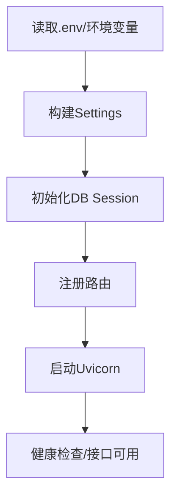

# L02 启动链路与配置治理

## 本课定位
学会从配置、依赖、启动、连通性四层排障，避免“启动问题只会重启”。

## 图解页

## 核心讲解
- 配置优先级决定线上可控性：环境变量优先于本地文件。
- `auth.json` 是补充通道，适合本地与中转场景。
- 启动排障要按层进行：配置 -> 依赖 -> 应用，不要直接改业务代码。

## 术语表
- **Fail Fast**：启动阶段尽快暴露不可恢复错误。
- **Config Drift**：配置漂移，环境不一致导致行为不一致。
- **Bootstrap**：应用启动时的初始化过程。

## 面试问题与标准答案
1. 为什么配置优先级很重要？  
答案：它决定线上修复效率和可预期性，优先级混乱会导致“看起来改了配置但不生效”。

2. 为何不只用 `.env`？  
答案：线上部署常依赖环境变量与密钥系统，单一 `.env` 方案缺乏扩展性。

3. 启动报错怎么快速定位？  
答案：先看配置解析结果，再测依赖连通性，最后看应用栈信息。

## 课后任务与参考答案
- 任务1：故意写错 `DATABASE_URL`，给出 8 步排障SOP。  
参考：包含日志位置、配置源、连通测试、修复验证四类动作。
- 任务2：写启动前检查清单。  
参考：DB、Redis、LLM、端口、迁移版本、种子数据六项。

