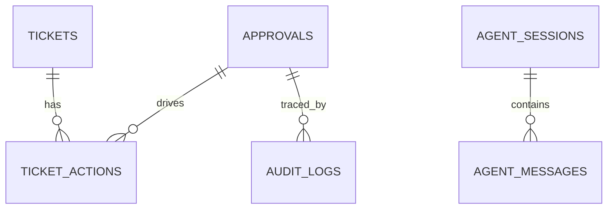

# L03 数据模型与索引设计

## 本课定位
让你从“会查表”升级到“会解释表为何这样设计”。

## 图解页

## 核心讲解
- `approvals` 是流程状态主表，不只是记录审批结果。
- `ticket_actions` 保留动作历史，支撑回放和责任追踪。
- 索引设计应围绕查询路径，而非“看到字段就加索引”。

## 术语表
- **Idempotency Key**：业务幂等键。
- **Hot Query**：高频查询路径。
- **Write Amplification**：索引过多导致写开销放大。

## 面试问题与标准答案
1. 为什么要 `idempotency_key`？  
答案：避免重复提案和重复执行，把重试行为收敛为同一业务结果。

2. 为什么动作历史不能只看主表最新状态？  
答案：主表只记录当前态，历史链路丢失后无法审计和复盘。

3. 索引如何评估有效性？  
答案：看执行计划、扫描行数、命中率和写入成本综合收益。

## 课后任务与参考答案
- 任务1：找出审批链路的3条关键查询并说明索引。  
参考：按审批号查详情、按状态查列表、按trace查审计。
- 任务2：写“索引新增评审模板”。  
参考：目标查询、预估收益、回滚方案必须齐全。

