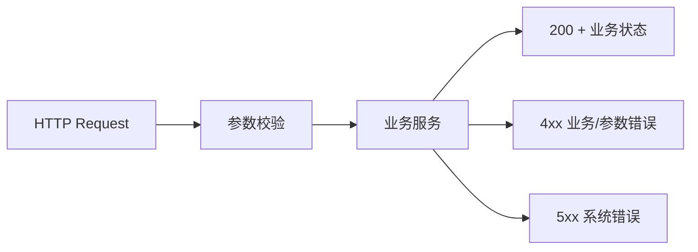

# L04 API契约与错误分层

## 本课定位
掌握“对外契约稳定性”思维，避免只关注内部实现。

## 图解页

## 核心讲解
- API 层职责是协议映射，不是业务编排。
- 错误分层可让前端和调用方稳定处理异常分支。
- 业务状态（completed/approval_required）要与HTTP状态同时设计。

## 术语表
- **Contract Test**：接口契约测试。
- **Backward Compatibility**：向后兼容。
- **Semantic Error Code**：语义化错误码。

## 面试问题与标准答案
1. 为什么要做错误映射？  
答案：把内部异常统一为对外可消费协议，减少客户端分支混乱。

2. 400和409如何区分？  
答案：400是输入不合法，409是资源状态冲突。

3. API怎么做版本兼容？  
答案：新增字段不破坏旧语义，破坏性变更走版本化并配套回归测试。

## 课后任务与参考答案
- 任务1：写10条错误码规范。  
参考：覆盖参数错、冲突、权限、系统错四类。
- 任务2：给chat接口写一条契约测试。  
参考：验证关键字段存在与类型稳定。

