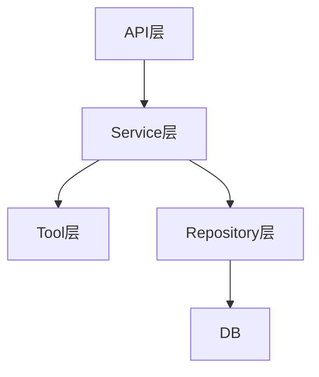

# L05 分层架构与职责边界

## 本课定位
建立“边界感”：什么该放 API、Service、Repository、Tool。

## 图解页

## 核心讲解
- 分层不是形式主义，是为了控制复杂度。
- 一段逻辑放错层，短期快，长期维护成本高。
- 面试里要强调“边界清晰比技术栈更重要”。

## 术语表
- **Separation of Concerns**：关注点分离。
- **Layer Leakage**：层职责泄漏。
- **Domain Service**：领域服务。

## 面试问题与标准答案
1. 如何判断逻辑应放哪层？  
答案：看关注点，协议相关放API，流程编排放Service，数据细节放Repo。

2. 分层是否越多越好？  
答案：不是，分层应服务于复杂度降低而非目录美观。

3. 何时需要重构层次？  
答案：当跨层调用混乱、排障成本上升、改动牵一发而动全身时。

## 课后任务与参考答案
- 任务1：找出一段疑似层泄漏代码并重构建议。  
参考：给出迁移前后职责对比图。
- 任务2：画一张本项目分层责任表。  
参考：每层至少写3条“应做/不应做”。

