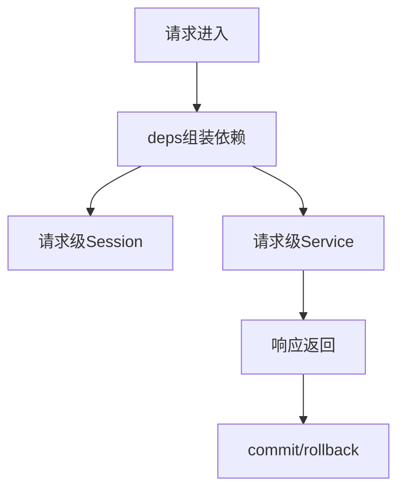

# L06 依赖注入与生命周期

## 本课定位
学会识别请求级对象和全局对象，避免并发污染。

## 图解页

## 核心讲解
- 请求级 session 是事务隔离基础。
- 注入集中在 `deps.py` 可提升一致性和可测试性。
- 上下文对象应透传 trace/user/session，保证审计完整。

## 术语表
- **Request Scope**：请求作用域。
- **Singleton**：单例对象。
- **Context Propagation**：上下文传播。

## 面试问题与标准答案
1. 为什么 `AgentService` 不做全局单例？  
答案：它依赖请求态对象，单例会造成并发状态污染。

2. commit/rollback 为什么在接口层？  
答案：接口层最清楚一次请求是否成功，易于统一事务边界。

3. 注入会不会有性能损耗？  
答案：有但很小，通常远小于IO与外部调用成本。

## 课后任务与参考答案
- 任务1：验证不同请求session对象不同。  
参考：打印对象id并对比。
- 任务2：新增一个依赖并接入get_agent_service。  
参考：确保不破坏现有路由。

