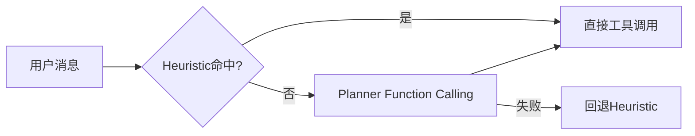

# L07 混合路由策略设计（Heuristic + Planner）

## 本课定位
掌握“规则与模型协同”的工程思路，而非单纯追求模型化。

## 图解页

## 核心讲解
- Heuristic负责高频确定性场景，成本低且可解释。
- Planner负责复杂意图，增强表达能力。
- 降级路径是生产系统稳定性的关键。

## 术语表
- **Fallback**：降级回退。
- **Long-tail Intent**：长尾意图。
- **Tool Calling**：函数/工具调用。

## 面试问题与标准答案
1. 为什么不做纯LLM路由？  
答案：纯LLM在成本、稳定性和可解释性上风险更高。

2. planner失败为何不直接报错？  
答案：业务系统以可用性优先，必须提供稳定降级能力。

3. 如何评估路由策略好坏？  
答案：看命中率、正确率、延迟、成本和失败恢复能力。

## 课后任务与参考答案
- 任务1：统计50条请求的heuristic命中率。  
参考：按意图类型分桶统计更有价值。
- 任务2：模拟planner失败并验证回退。  
参考：检查最终status与tool_calls是否合理。

