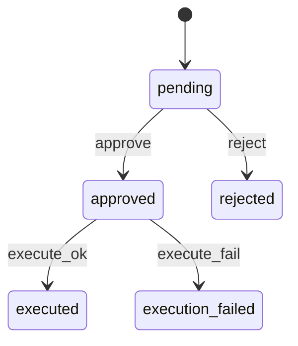

# L08 写操作安全架构（Verifier + 状态机 + 幂等）

## 本课定位
把“安全执行”讲成可验证、可复盘的工程体系。

## 图解页

## 核心讲解
- Verifier 是输入与权限防线。
- 状态机是流程合法性防线。
- 幂等键是重复请求防线。
- 三者共同构成写操作安全闭环。

## 术语表
- **State Machine**：状态机。
- **Optimistic Concurrency**：乐观并发控制。
- **Idempotent Execution**：幂等执行。

## 面试问题与标准答案
1. 为什么状态机要独立模块化？  
答案：集中规则、降低散落if/else导致的非法迁移风险。

2. 重复审批如何处理？  
答案：已执行直接返回结果，冲突状态返回明确错误。

3. 执行失败是否自动重试？  
答案：不盲重试，需先判断失败类型，避免副作用放大。

## 课后任务与参考答案
- 任务1：并发approve同一单据，观察冲突行为。  
参考：记录状态与错误码并解释原因。
- 任务2：人工触发execution_failed并回放审计链。  
参考：核对approval状态与audit事件一致。

