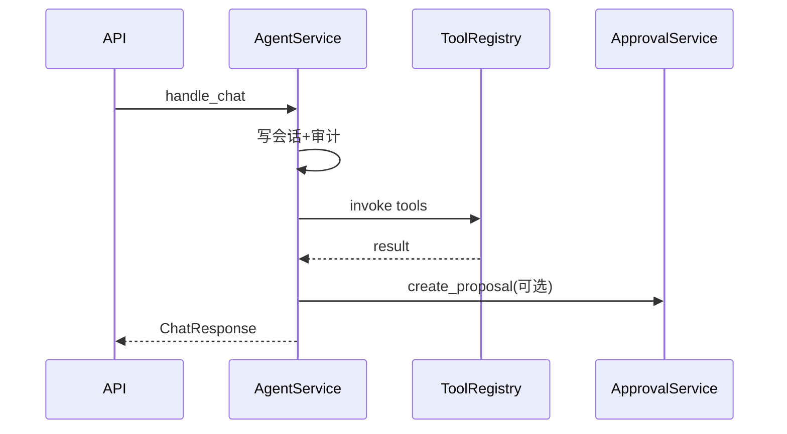

# L09 AgentService 编排实战

## 本课定位
逐步吃透 `handle_chat`，做到“代码级解释 + 架构级抽象”。

## 图解页

## 核心讲解
- 编排函数承担“业务总控台”角色。
- 每个阶段要有可观测点，方便性能与故障定位。
- 结构化返回是前后端联调效率关键。

## 术语表
- **Orchestration**：编排。
- **Critical Path**：关键路径。
- **Phase Timing**：分段耗时。

## 面试问题与标准答案
1. 编排函数过长怎么办？  
答案：按阶段拆辅助函数并保留主流程可读性。

2. 为什么先写审计再执行工具？  
答案：先固化请求事实，确保异常分支仍可追溯。

3. 何时提交事务最合理？  
答案：请求成功闭环后统一提交，异常统一回滚。

## 课后任务与参考答案
- 任务1：输出一次请求各阶段耗时。  
参考：至少包含路由、工具、写回三段。
- 任务2：画完整时序图并标注异常分支。  
参考：异常分支也要标审计事件。

