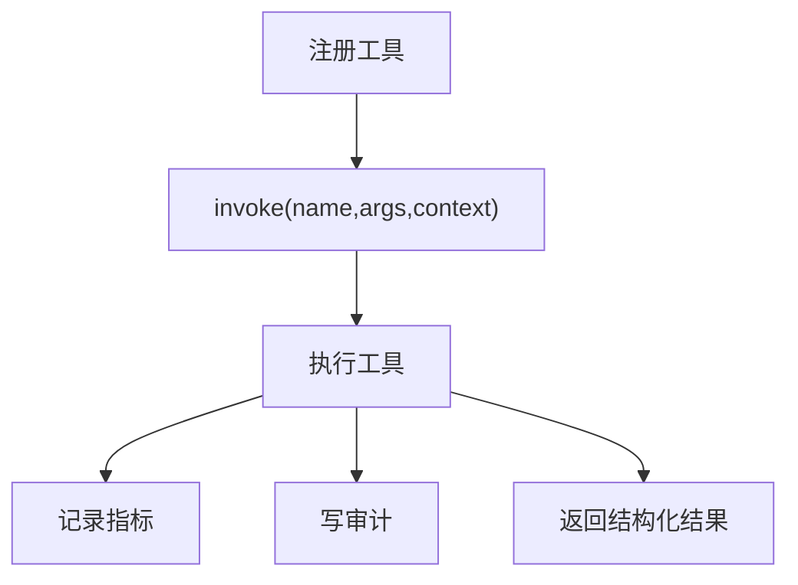

# L10 ToolRegistry 治理模式

## 本课定位
理解“统一执行框架”如何提升可扩展性与治理质量。

## 图解页

## 核心讲解
- registry 让工具执行标准化：输入、输出、异常路径一致。
- 它是工具体系的“控制平面”。
- 工具数量增大时，统一治理收益会迅速放大。

## 术语表
- **Control Plane**：控制平面。
- **Execution Record**：执行记录。
- **Observability Hook**：可观测钩子。

## 面试问题与标准答案
1. 为什么不直接调用工具函数？  
答案：直接调用难以统一埋点、审计和异常治理，扩展性差。

2. registry 会不会成为单点复杂度？  
答案：会，需要按业务域拆分注册与执行策略，保持模块化。

3. 工具失败怎么处理最合理？  
答案：结构化记录失败信息并向上抛出，由编排层决定恢复策略。

## 课后任务与参考答案
- 任务1：新增一个只读工具并完成注册。  
参考：必须补工具schema和审计验证。
- 任务2：为invoke增加超时保护。  
参考：超时也要记录tool_failed事件。

