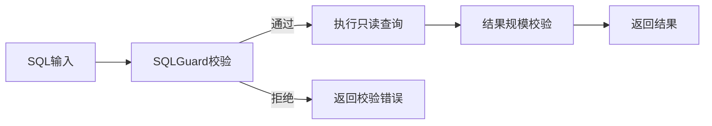

# L11 只读工具与SQL防线

## 本课定位
让查询能力“可用且可控”，防止任意SQL风险外溢。

## 图解页

## 术语表
- SQL Guard：SQL安全规则校验器
- Allowlist：白名单策略
- Result Cap：结果上限控制

## 面试问题与标准答案
1. SQLGuard的边界是什么？  
答案：能拦明显危险模式，但不能替代权限模型与参数化查询。
2. 为什么限制结果大小？  
答案：保护系统稳定，避免大结果拖垮服务与网络。
3. 如何进一步增强查询安全？  
答案：按角色分配查询能力，敏感查询走审批或离线任务。

## 课后任务与参考答案
- 任务：构造5条合法/非法SQL并记录行为。  
参考：分类说明“拒绝原因”和“改写建议”。

