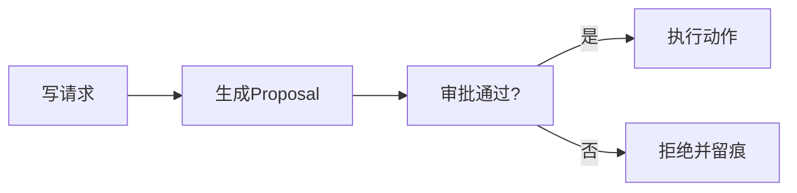

# L12 写工具 Proposal 模式

## 本课定位
理解“先描述命令，再执行命令”的治理价值。

## 图解页

## 术语表
- Proposal：待审批动作
- Command Pattern：命令模式
- Approval Required：需审批状态

## 面试问题与标准答案
1. Proposal模式核心收益？  
答案：把高风险动作前置治理，支持审查、追踪和回放。
2. 为什么payload schema重要？  
答案：它是命令契约，决定校验和兼容演进能力。
3. action_type增多如何维护？  
答案：注册表+统一基类+schema验证，避免分支膨胀。

## 课后任务与参考答案
- 任务：新增一个 `propose_close_ticket`。  
参考：仅生成proposal，不允许直接执行。

