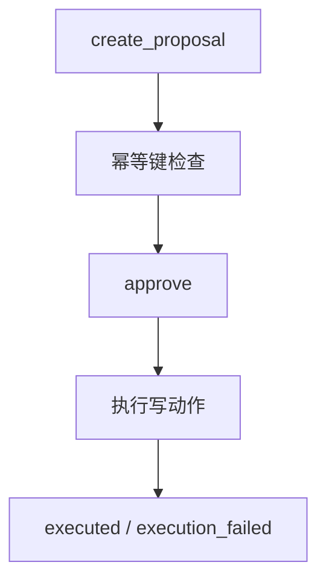

# L13 ApprovalService 并发一致性

## 本课定位
将审批逻辑按交易系统标准理解：幂等、冲突、状态、恢复。

## 图解页

## 术语表
- StaleDataError：并发更新冲突
- IntegrityError：唯一约束冲突
- Idempotent Replay：幂等重放

## 面试问题与标准答案
1. 如何避免重复执行？  
答案：幂等键+状态检查+冲突处理三层防线。
2. 为什么先approved再执行？  
答案：先固化授权事实，防止执行成功但状态不明。
3. execution_failed后怎么办？  
答案：保留错误证据，走人工复核或新提案重试。

## 课后任务与参考答案
- 任务：并发approve同一单据，分析结果。  
参考：关注状态、错误码、审计一致性。

