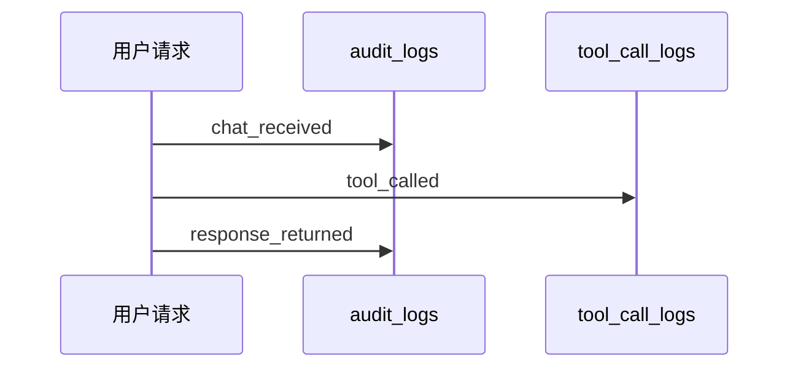

# L14 审计系统与可回放

## 本课定位
把“记录日志”升级为“还原事实链”。

## 图解页

## 术语表
- Audit Event：审计事件
- Trace Replay：链路回放
- Event Taxonomy：事件分类体系

## 面试问题与标准答案
1. 审计为什么不能等同应用日志？  
答案：应用日志偏技术细节，审计日志偏业务事实与合规证据。
2. trace_id价值？  
答案：跨模块关联键，支持一次请求全链路回放。
3. 审计数据大了怎么办？  
答案：冷热分层、索引优化、归档策略、保留周期治理。

## 课后任务与参考答案
- 任务：按trace_id回放一次写操作全链路。  
参考：列出时间线和关键状态变化。

