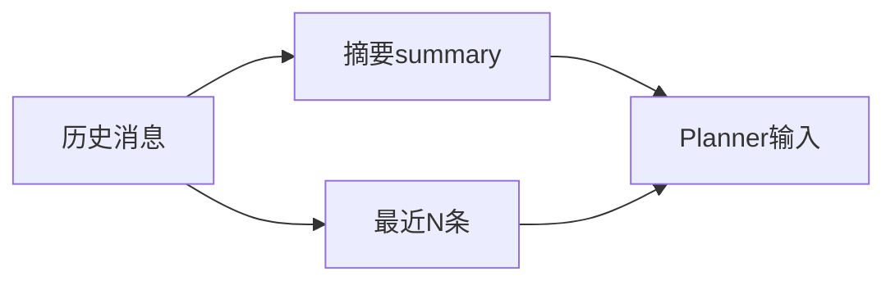

# L15 会话记忆与上下文控制

## 本课定位
理解多轮对话上下文如何影响决策质量与成本。

## 图解页

## 术语表
- Context Window：上下文窗口
- Summary Drift：摘要漂移
- Token Budget：Token预算

## 面试问题与标准答案
1. 为什么不用全量历史？  
答案：成本高、噪声大、延迟高，且未必提升效果。
2. summary错误影响？  
答案：会把工具决策带偏，需抽检和重算策略。
3. memory与RAG区别？  
答案：memory是会话内语境，RAG是外部知识检索。

## 课后任务与参考答案
- 任务：调整recent消息数量，观察输出变化。  
参考：记录质量变化和时延变化。

