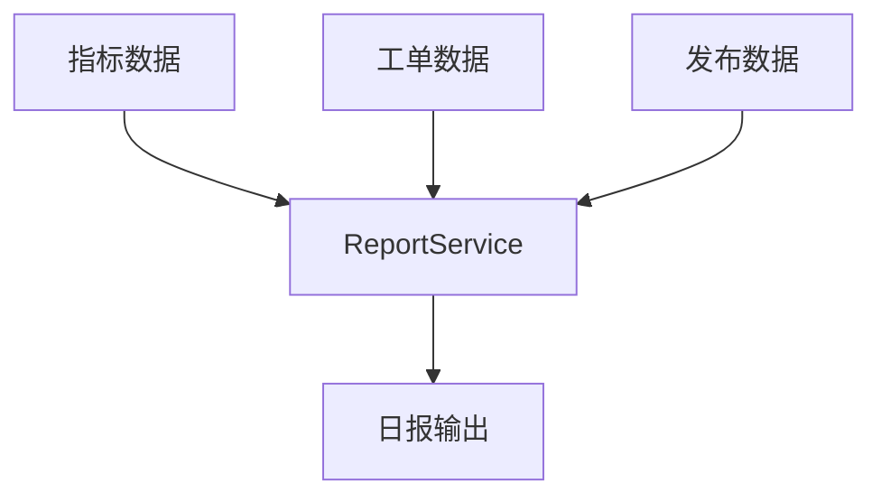

# L16 报表服务与聚合查询

## 本课定位
学习如何将多数据源聚合成高价值业务输出。

## 图解页

## 术语表
- Aggregation：聚合
- Report Contract：报表契约
- Precompute：预计算

## 面试问题与标准答案
1. 为什么日报做成工具？  
答案：可纳入统一编排、审计和权限体系，复用性更强。
2. 报表慢怎么办？  
答案：预计算、缓存、异步生成、字段裁剪。
3. 口径变化怎么治理？  
答案：口径版本化并在输出中显式标注版本。

## 课后任务与参考答案
- 任务：新增“审批执行成功率”到日报。  
参考：同时更新说明文档与测试样例。

