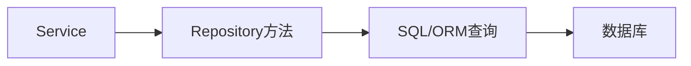

# L17 Repository 抽象与查询性能

## 本课定位
掌握“抽象可维护性”和“查询性能”之间的平衡。

## 图解页

## 术语表
- Query Plan：执行计划
- N+1 Query：N+1查询
- Semantic Repository：语义化仓储接口

## 面试问题与标准答案
1. repository会遮蔽性能问题吗？  
答案：会，所以必须结合SQL日志和profiling。
2. 何时直写SQL？  
答案：复杂统计、性能关键路径、ORM表达困难场景。
3. 如何防N+1？  
答案：批量查询、预加载、聚合查询和字段裁剪。

## 课后任务与参考答案
- 任务：抓一条慢SQL并提出优化方案。  
参考：给出索引/改写前后对比。

