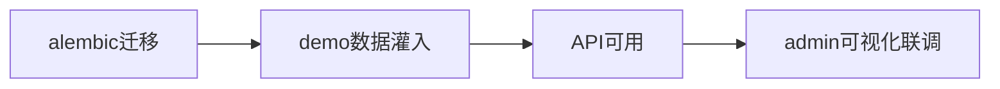

# L18 迁移灌数与管理后台

## 本课定位
从“代码实现”走到“可演示、可回归、可协作”的工程闭环。

## 图解页

## 术语表
- Migration：数据库迁移
- Seed Data：种子数据
- Demo Reproducibility：演示可复现性

## 面试问题与标准答案
1. seed脚本有什么价值？  
答案：保证演示、测试、排障都可复现，降低协作成本。
2. 迁移如何防线上事故？  
答案：向前兼容迁移、灰度验证、备份与回滚预案。
3. admin页面是否必要？  
答案：对复杂流程系统非常必要，能显著缩短联调链路。

## 课后任务与参考答案
- 任务：从空库完成迁移+灌数并走完整审批流程。  
参考：保留过程截图用于面试证据。

