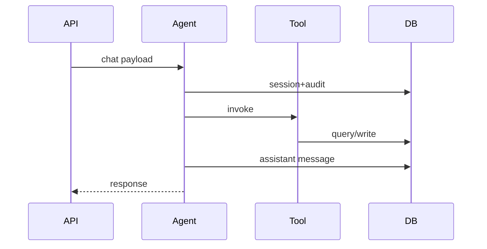

# L19 Chat 端到端时序

## 本课定位
把一次请求拆成可测量、可定位、可优化的时序阶段。

## 图解页

## 术语表
- End-to-end Latency：端到端延迟
- Stage Timing：分段耗时
- Critical Path：关键路径

## 面试问题与标准答案
1. 关键耗时在哪里？  
答案：路由决策、工具执行、数据库提交通常是三大耗时点。
2. 如何定位长尾请求？  
答案：按trace_id看阶段耗时并关联工具/SQL日志。
3. 为什么业务状态也要统计？  
答案：HTTP成功不代表业务完成，状态分布更反映真实质量。

## 课后任务与参考答案
- 任务：输出一次请求的阶段耗时报告。  
参考：至少包含6个阶段并给优化建议。

