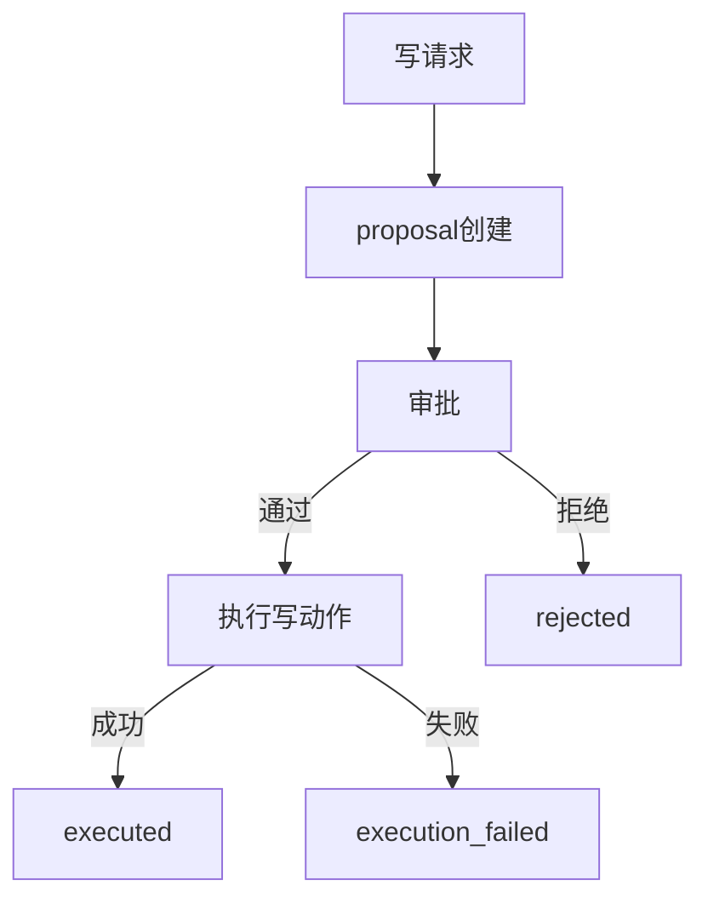

# L20 写链路全流程剖析（Proposal->Approve->Execute）

## 本课定位
把写链路讲成“可控事务流程”，并具备异常分析能力。

## 图解页

## 术语表
- Proposal Reuse：提案复用
- Approval Transition：审批状态迁移
- Execution Failure：执行失败态

## 面试问题与标准答案
1. approved为什么不是终态？  
答案：approved只是授权通过，执行结果仍未知。
2. 拒绝和执行失败有何不同？  
答案：拒绝是授权层拒绝，执行失败是执行层失败。
3. 如何保证链路可追溯？  
答案：proposal、审批事件、执行事件都带trace并落审计。

## 课后任务与参考答案
- 任务：各跑一次approve和reject并对比审计链。  
参考：形成状态变化与事件对照表。

