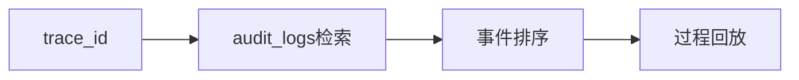

# L21 审计回放实战

## 本课定位
训练“用证据说话”的能力：按trace_id重建业务事实。

## 图解页

## 术语表
- Event Replay：事件回放
- Evidence Chain：证据链
- Forensics：事后分析

## 面试问题与标准答案
1. 回放的价值是什么？  
答案：定位故障、追责、复盘和回归验证。
2. 为什么要事件类型分类？  
答案：便于过滤和聚合分析，降低查询噪音。
3. 查询慢怎么办？  
答案：索引、分区、冷热分层和归档。

## 课后任务与参考答案
- 任务：选一条trace做完整回放报告。  
参考：报告至少含时间线、状态、结论、改进项。

