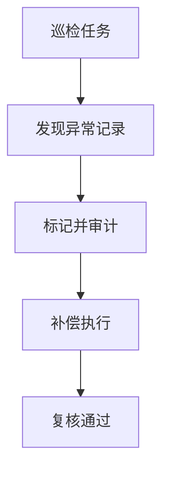

# L22 一致性巡检与补偿

## 本课定位
学会发现并修复“状态看起来成功、数据却不一致”的隐性问题。

## 图解页

## 术语表
- Consistency Check：一致性巡检
- Compensation：补偿
- Reconciliation：对账

## 面试问题与标准答案
1. 一致性问题常见来源？  
答案：并发冲突、重试、跨系统写入非原子、异常中断。
2. 巡检指标怎么定？  
答案：围绕关键关系定义，如executed审批必须有动作记录。
3. 补偿如何防二次伤害？  
答案：补偿本身要幂等、可回滚、可审计。

## 课后任务与参考答案
- 任务：写一条巡检SQL并输出异常样例。  
参考：补偿流程包含“检测-执行-验证-留痕”。

