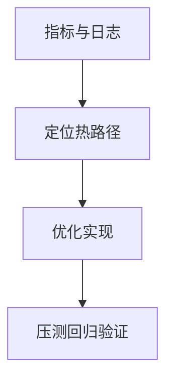

# L24 热路径优化策略

## 本课定位
掌握“先找热点再优化”的方法论，避免低收益优化。

## 图解页

## 术语表
- Hot Path：热路径
- Bottleneck：瓶颈
- Regression：回归

## 面试问题与标准答案
1. 优化优先级如何排？  
答案：高频且高耗时优先，其次高风险路径。
2. 规则路由增多会怎样？  
答案：命中提升但维护成本上升，需规则治理。
3. DB优化常见误区？  
答案：只加索引不看执行计划和写放大。

## 课后任务与参考答案
- 任务：优化1条慢查询并给前后对比。  
参考：说明收益、成本、风险。

