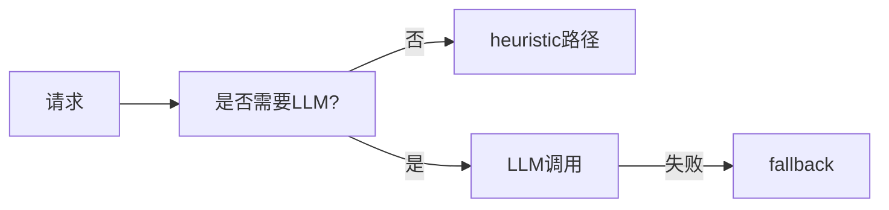

# L25 LLM成本与稳定性治理

## 本课定位
把模型调用从“功能可用”提升为“成本可控、稳定可用”。

## 图解页

## 术语表
- Fallback：降级
- Token Budget：token预算
- Model Routing：模型路由

## 面试问题与标准答案
1. 如何降本？  
答案：提升heuristic命中、缩短上下文、减少无效调用。
2. 为什么必须降级？  
答案：外部依赖不稳定时，系统仍需可用。
3. 如何做模型灰度？  
答案：分流+指标阈值+自动回滚策略。

## 课后任务与参考答案
- 任务：统计planner触发率并分析降本空间。  
参考：给出三条可执行优化建议。

