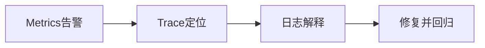

# L26 可观测驱动优化闭环

## 本课定位
学会把“监控看板”变成“优化执行系统”。

## 图解页

## 术语表
- SLI/SLO：服务指标/目标
- Alert Fatigue：告警疲劳
- MTTR：平均恢复时间

## 面试问题与标准答案
1. 指标、trace、日志怎么分工？  
答案：指标发现，trace定位，日志解释细节。
2. 何为有效告警？  
答案：触发后有明确负责人和动作路径。
3. 如何避免监控泛滥？  
答案：每个指标绑定业务价值和处置策略。

## 课后任务与参考答案
- 任务：定义3条报警及runbook。  
参考：包含阈值、处理人、升级策略。

