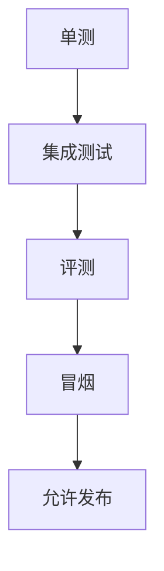

# L27 测试体系与发布门禁

## 本课定位
建立“测试即交付保障”思维，而非“测试只是开发自检”。

## 图解页

## 术语表
- Release Gate：发布门禁
- Integration Test：集成测试
- Smoke Test：冒烟测试

## 面试问题与标准答案
1. 单测覆盖高为何仍会出事故？  
答案：系统级问题常在集成与数据流层暴露。
2. 发布门禁如何量化？  
答案：关键接口通过率、评测阈值、错误回归数。
3. 冒烟与压测差异？  
答案：冒烟验证可用，压测验证容量。

## 课后任务与参考答案
- 任务：写一份发布门禁清单。  
参考：至少包含3条硬门槛和回滚触发条件。

