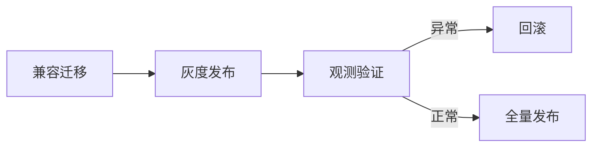

# L28 部署发布与回滚策略

## 本课定位
掌握“可上线、可灰度、可回滚”的完整交付链条。

## 图解页

## 术语表
- Canary：金丝雀发布
- Rollback：回滚
- Forward Compatible：向前兼容

## 面试问题与标准答案
1. 迁移和代码谁先发？  
答案：先兼容迁移后发代码，避免依赖缺失。
2. 回滚触发如何定义？  
答案：核心业务指标越阈值立即触发。
3. 灰度期间看什么？  
答案：成功率、延迟、关键业务状态分布。

## 课后任务与参考答案
- 任务：设计灰度发布SOP。  
参考：步骤、阈值、回滚责任人必须明确。

