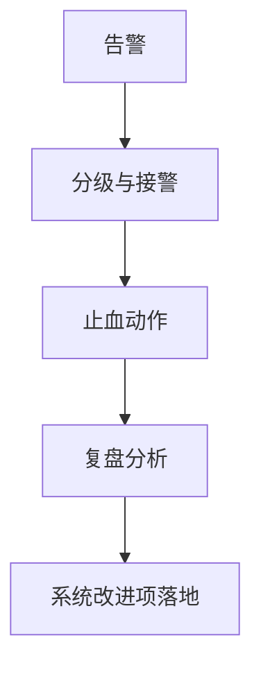

# L29 SRE化运营与Runbook

## 本课定位
从“开发完成”走到“线上长期稳定运行”。

## 图解页

## 术语表
- Incident Triage：故障分级
- Runbook：处置手册
- RCA：根因分析

## 面试问题与标准答案
1. 如何避免告警疲劳？  
答案：降噪、分级、聚合，并确保告警可行动。
2. runbook最关键内容？  
答案：定位路径、止血动作、升级规则、责任人。
3. 复盘应输出什么？  
答案：系统改进项与闭环时间表，不止时间线。

## 课后任务与参考答案
- 任务：写“审批失败率激增”runbook。  
参考：包含5分钟止血方案和24小时复盘计划。

