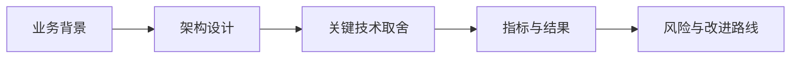

# L30 一面项目讲解实战

## 本课定位
把所有技术点转化为“可被追问、可被验证、可被认可”的面试表达。

## 图解页

## 术语表
- STAR：情境-任务-行动-结果
- Tradeoff：取舍
- Evidence-based Answer：证据化回答

## 面试问题与标准答案
1. 5分钟如何讲完项目？  
答案：背景->架构->链路->治理->结果，按固定模板输出。
2. 被深挖时如何不乱？  
答案：先结论，再证据，再tradeoff，最后改进。
3. 如何讲不足反而加分？  
答案：承认边界并给出可执行升级路线，体现工程判断力。

## 课后任务与参考答案
- 任务：录制5分钟和15分钟两版讲解。  
参考：每版都要给出1个架构图和1组指标证据。

